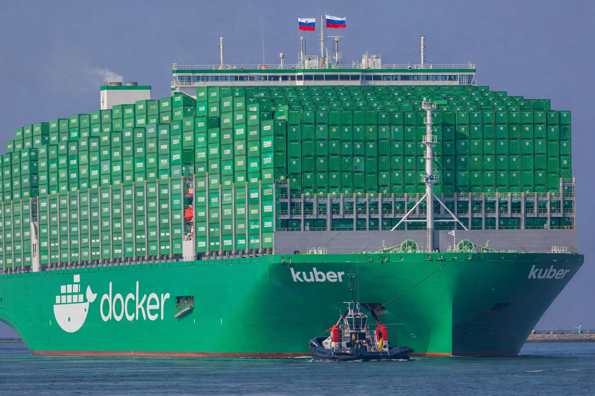
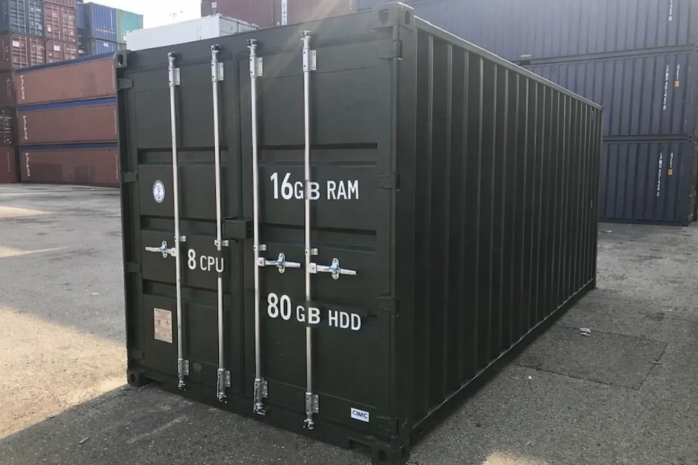
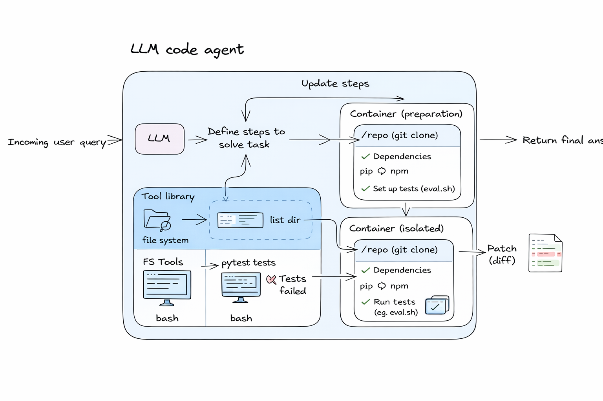
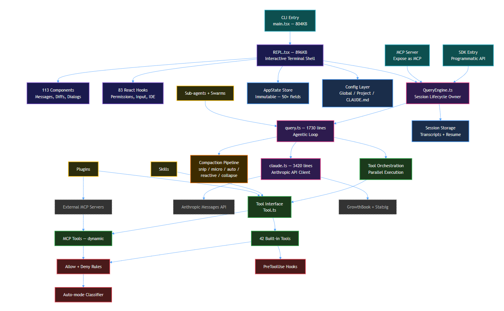
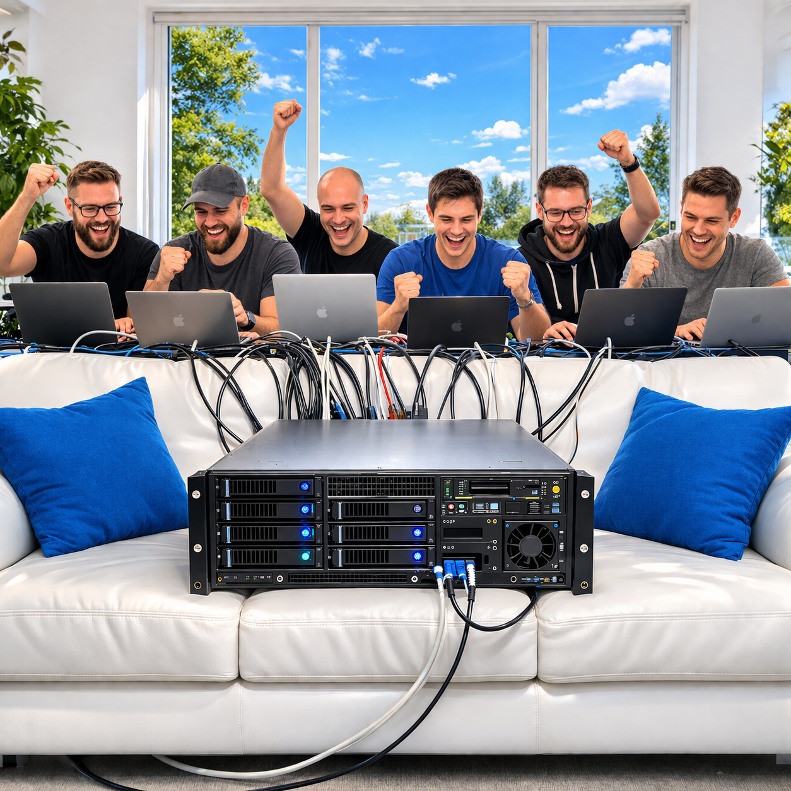
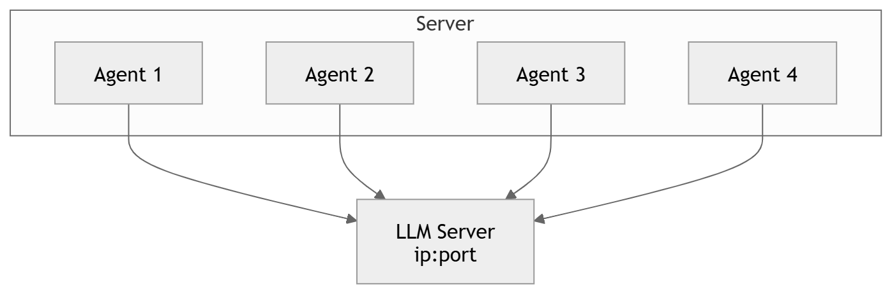
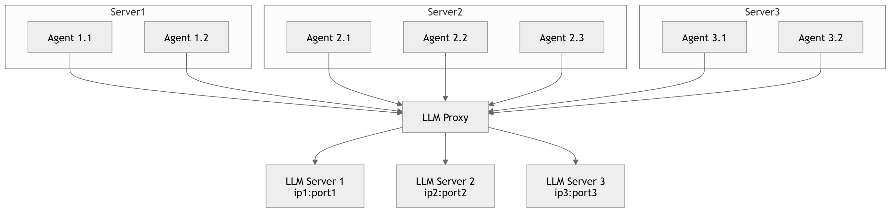

# Инфраструктура для 1000 кодовых агентов: путь от одного контейнера к тысячам

> JPoint 2026 | Егор Булычев
> ~100 слайдов | ~60 минут

---

## Часть 0: Зачем вы здесь

---

### **Как построить инфраструктуру для масштабного запуска кодовых агентов**




Егор Булычев | JPoint 2026


---

### Кому и зачем

> Каждый из вас уже пользуется кодовыми агентами — GigaIDE, Codex, Cursor, Claude Code...

> И каждому хотелось бы узнать, какой путь надо пройти, чтобы сделать сильную агентную кодовую модель

> В этом докладе я расскажу про масштабирование агентов

Этот доклад — про **кухню**: как запустить 1000 агентов параллельно и не сжечь кластер

---

### Кто я?
> Работаю в GigaCode в Сбере
> Работал в Huawei - занимался кодовыми моделями
> Работал в JetBrains
> Работал в стартапе, занимавшимся ML4Code еще до того, как это стало модным в 2017~2019 годах

---

### О чём пойдёт речь

1. 1 агент
2. 10 агентов
3. 100 агентов
4. стремление к 1000 агентов

И о вагоне сложностей/интересностей, с которыми пришлось столкнуться по пути

---

### Почему 1000 агентов?

- MiniMax, OpenAI, Anthropic — публикуют статьи о масштабировании
- Цикл: **сбор данных → обучение → обмер модели** — должен быть быстрым
- 1000 параллельных агентов ≈ минимальная планка для быстрых итераций
- Цель: модель с близкими к SoTA-результатами на кодовых бенчмарках

---

### Чем программирование особенное?


---

### Чем программирование особенное?

В отличие от математики, текста, изображений:

- **Нужна изоляция**: каждая задача = свой контейнер с окружением
- **Автоматическая верификация**: автоматически проверяем тесты проходят или нет

За дополнительную сложность делаем возможным автоматическое масштабирование и верифицирование

---


### Зачем масштабировать?

> **СПОЙЛЕР:** лучшая модель у того, у кого быстрее итерации

<style scoped>
table {
    font-size: 15px;
    width: 100%;
    border-collapse: collapse;
}
th, td {
    border: 1px solid #ddd;
    padding: 8px;
    text-align: left;
}
th {
    background-color: #f2f2f2;
}
</style>

<table style="width: 100%; table-layout: fixed;">
  <thead>
    <tr>
      <th style="width: 25%;"></th>
      <th style="width: 25%;">БЫЛО (до платформы)</th>
      <th style="width: 25%;">СЕЙЧАС</th>
      <th style="width: 25%;">ЦЕЛЬ (ближайшая)</th>
    </tr>
  </thead>
  <tbody>
    <tr>
      <td><b>Вычисления (CPU)</b></td>
      <td>2 сервера, ручной Docker</td>
      <td>Kubernetes, 11+ нод, ресурсы на лету</td>
      <td>Эластичный кластер, авто-скейлинг</td>
    </tr>
    <tr>
      <td><b>Инференс (GPU)</b></td>
      <td>8 GPU, 1 машина</td>
      <td>96 GPU (12 × 8), единая точка доступа</td>
      <td>200+ GPU, объединение кластеров</td>
    </tr>
    <tr>
      <td><b>Параллельные агенты</b></td>
      <td>20 на 1 сервере</td>
      <td>200 стабильно</td>
      <td>1 000</td>
    </tr>
    <tr>
      <td><b>Замер бенчмарка (500 задач)</b></td>
      <td>~9–14 часов</td>
      <td>~2 часа</td>
      <td>&lt; 1 час</td>
    </tr>
    <tr>
      <td><b>Генерация 100к решений задач</b></td>
      <td>~100 дней</td>
      <td>~10 дней</td>
      <td>~дни</td>
    </tr>
  </tbody>
</table>

---

### Зачем масштабировать?

<style scoped>
table {
    font-size: 18px;
    width: 100%;
    border-collapse: collapse;
}
th, td {
    border: 1px solid #ddd;
    padding: 12px;
    text-align: left;
}
th {
    background-color: #f2f2f2;
}
</style>

<table style="width: 100%; table-layout: fixed;">
  <thead>
    <tr>
      <th style="width: 25%;">Стадия</th>
      <th style="width: 25%;">БЫЛО</th>
      <th style="width: 25%;">СЕЙЧАС</th>
      <th style="width: 25%;">ЦЕЛЬ (ближайшая)</th>
    </tr>
  </thead>
  <tbody>
    <tr>
      <td><b>Сбор данных</b></td>
      <td>100 дней</td>
      <td>10 дней</td>
      <td>2 дня</td>
    </tr>
    <tr>
      <td><b>Обучение</b></td>
      <td>7 дней</td>
      <td>7 дней</td>
      <td>7 дней</td>
    </tr>
    <tr>
      <td><b>Обмеры</b></td>
      <td>~1 день</td>
      <td>~2 часа</td>
      <td>~2 часа</td>
    </tr>
    <tr style="background-color: #f9f9f9; font-weight: bold;">
      <td>Суммарно</td>
      <td>~107 дней</td>
      <td>~17 дней</td>
      <td>~9 дней</td>
    </tr>
    <tr style="background-color: #eef; font-weight: bold;">
      <td>Ускорение</td>
      <td>1</td>
      <td>~6×</td>
      <td>~11×</td>
    </tr>
  </tbody>
</table>

<br>

**Зачем:** За то же самое время можно проверить в ~10 раз больше гипотез.

---

## Один агент



---

### Что такое кодовый агент?

- LLM + набор инструментов (чтение файлов, редактирование, bash)
- Получает задачу: «исправь баг» / «добавь фичу»
- Работает в **изолированном окружении** (контейнер с клоном репозитория)
- Завершает работу (и мы извлекаем патч, например)

---

### Что такое кодовый агент? # TODO - картинку нормальную сделать



---

### Анатомия запуска задачи - три фазы задачи

1. **Подготовка**: клонировать репозиторий, установить зависимости
2. **Решение**: запускается LLM + агентный фреймворк + изолированное окружение -> и агент вносит изменения
3. **Проверка**: запуск тестов, сбор результатов

> грубо один агент работает на SWE bench подобной задачей по фиксу проблемы 5~20 минут

---

### Агентный фреймворк


---

### С чем придется столкнуться при разработке агентного фреймворка

Разработка агента — это не только промпты. Это 80+% системного программирования:

*   **Reliability & Retries**: Модели «отваливаются» по таймаутам, 429 (Rate Limit) и 529 (Overloaded). Нужна умная очередь и экспоненциальный бэкбофф.
*   **Tooling**: Для кодовых моделей можно сделать много специализированных инструментов, которые будут помогать избегать ошибок типа поломанного кода (на основе tree-sitter,например) или автоматически проверять стиль.
*   **Context Management**: Бесконечный цикл «Tool Use -> Result» быстро забивает 200k контекста. Нужна многослойная компакция (snip, micro, auto-summarization).

А также потом проверить, как любое изменение влияет на конечный результат

---

### Оценка трудозатрат на топовый агентный фреймворк
> Спасибо неожиданному облачному бэкапу кодовой базы Claude Code
* 2k файлов
* 513k строчек
* 10~15 человек (начинали с 2х)
* ~12-18 месяцев (какое-то время работали до публичного релиза)

> но базовый агентный фреймворк на коленке можно сделать за несколько дней

---

### TLDR
* нужна изоляция для задачи
* нужен агентный фреймворк
* нужен провайдер LLM (облачный или свой vllm)

---
# Десять агентов


---
# Контекст
* 10-20 разработчиков-исследователей
* несколько серверов мощных с кучей CPU/RAM/disc
* docker'ы и тд - все доступно
* есть определенные ограничения безопасности - типа не выставлять наружу порты

---
# Задачи
* обмеры моделей
* эксперименты с агентными фреймворками
* сбор задач для агентов
* генерация синтетических данных для обучения

---
# Сбор задач для агентов
* перед тем как что-то решать агенту - надо подготовить задачу ему
* два пути
  * сбор реальных задач
  * сбор синтетических задач

---
# Сбор реальных задач
* SWE-MERA направление - бенчмарк под ключ
* парсить гитхаб - искать связанные issues <-> PR в репозиториях
* клонировать репозиторий
* подготовить образ
  * тут отдельная большая история с подготовкой команд для установки
* верифицировать корректность задачи
  * до фикса какие-то тесты падают
  * после фикса проходят

---
# Сбор синтетических задач
* парсить гитхаб, чтобы найти подходящие репозитории
* клонировать репозиторий
* подготовить образ
* верифицировать образ
  * все тесты должны проходить
* найти покртые тестами функции
* повредить их
  * проверить, что тесты не проходят

---
# Обмеры моделей и генерация синтетических данных для обучения
* концептуально одинаковые задачи
* генерация и там, и там
* верификация и там, и там
* по сути map-reduce
  * map - для каждой задачи запустил агента
  * reduce - в конце посчитал pass rate или сохранил данные для обучения


---
# Что может пойти не так?


---
# Что может пойти не так?
Диски не бесконечные
* все пайплайны какие-то артефакты производят
* докеры занимают место
* ты не знаешь, нужны ли данные это
* МНОГО раз надо было коммуницировать, чтобы очистить место

---
# Что может пойти не так?
CPU/RAM не бесконечные
* коллеги запускают пайплайны
* они начинают падать, тк не хватает RAM
* они начинают тормозить, тк не хватает CPU

---
# Что может пойти не так?
Кто-то из коллег все таки может запустить агента без изоляции
* агент может запустить какой-то сервис для дебага на "нулях"
* безопасники автоматически детектируют нарушение
* прокидывают обучающий градиент

---
# Что может пойти не так?
Добавление железа требует усилий команды
* настройка
* выдача доступов КАЖДОМУ человеку на каждый новый сервак

---
# Что может пойти не так?
Кто какой порт занимает с vllm?
* много параллельных экспериментов
* у многих свои vllm подняты
* понять, кто занимает без обсуждения невозможно
* нет возможности МНОГО vllm сразу использовать для нагруженных пайплайнов

---
# Что может пойти не так?
Не смотря на наличие железа, нет возможности оркестрировать нормально
* надо настраивать окружение на нескольких машинх
* надо запускать скрипты на нескольких машинах
* как-то делить между ними задачи
* как-то собирать результаты

---
# Что может пойти не так?
Где лежат какие-то результаты - знает тот кто их сделал
* где результаты бенчмарка для модели (особенно если не внесены в командную вики)
* надо запускать скрипты на нескольких машинах
* как-то делить между ними задачи
* как-то собирать результаты

---
# Что может пойти не так?
Хранение секретов, ключей
* много людей - много секретов
* делиться ключами разными через файловую систему

---
# Что может пойти не так?
TLDR
* отсутствие масштабирования для пайплайнов
* инфраструктурный ад
или
* вместо использования железа для результатов
* агенты дерутся за CPU & RAM & DISC

---
# ....


---
# Время переосмыслить процессы
#TODO мем вставить какой

---
# Разделение зон отвественности
* исследователи - исследуют
* devops'ы devops'ят


tldr - позвали девопсов на помощь

---
# Bare Metal vs Kubernetes

<style scoped>
table {
    font-size: 15px;
    width: 100%;
    border-collapse: collapse;
}
th, td {
    border: 1px solid #ddd;
    padding: 6px;
    text-align: left;
}
th {
    background-color: #f2f2f2;
}
</style>

<table style="width: 100%; table-layout: fixed;">
  <thead>
    <tr>
      <th style="width: 40%;">Критерий / Задача</th>
      <th style="width: 30%;">Bare Metal</th>
      <th style="width: 30%;">Kubernetes</th>
    </tr>
  </thead>
  <tbody>
    <tr>
      <td><b>Масштабирование</b><br><span style="font-size: 12px;">(запуск множества агентов)</span></td>
      <td style="background-color: #ffe6e6;">❌ Минус</td>
      <td style="background-color: #e6ffe6;">✅ Плюс<br><span style="font-size: 12px;">(можно запускать на многих серверах сразу)</span></td>
    </tr>
    <tr>
      <td><b>CPU/RAM</b></td>
      <td style="background-color: #ffe6e6;">❌ Минус</td>
      <td style="background-color: #e6ffe6;">✅ Плюс<br><span style="font-size: 12px;">(учитывает лимиты при запуске)</span></td>
    </tr>
    <tr>
      <td><b>Изоляция</b></td>
      <td style="background-color: #ffe6e6;">❌ Минус</td>
      <td style="background-color: #e6ffe6;">✅ Плюс<br><span style="font-size: 12px;">(работает ТОЛЬКО с контейнерами)</span></td>
    </tr>
    <tr>
      <td><b>Добавление железа</b></td>
      <td style="background-color: #ffe6e6;">❌ Минус</td>
      <td style="background-color: #e6ffe6;">✅ Плюс</td>
    </tr>
    <tr>
      <td><b>Хранение секретов</b></td>
      <td style="background-color: #ffe6e6;">❌ Минус</td>
      <td style="background-color: #e6ffe6;">✅ Плюс</td>
    </tr>
    <tr>
      <td><b>Многошаговые пайплайны</b><br><span style="font-size: 12px;">(DAG: установка → агент → тесты)</span></td>
      <td style="background-color: #e6ffe6;">✅ Плюс<br><span style="font-size: 12px;">(всё просто делается на Python)</span></td>
      <td style="background-color: #ffe6e6;">❌ Минус<br><span style="font-size: 12px;">(нет поддержки DAG из коробки)</span></td>
    </tr>
    <tr>
      <td><b>Диски</b></td>
      <td style="background-color: #ffe6e6;">❌ Минус</td>
      <td style="background-color: #ffe6e6;">❌ Минус</td>
    </tr>
    <tr>
      <td><b>vLLM proxy</b><br><span style="font-size: 12px;">(занятые порты)</span></td>
      <td style="background-color: #ffe6e6;">❌ Минус</td>
      <td style="background-color: #ffe6e6;">❌ Минус</td>
    </tr>
  </tbody>
</table>


---
# Время переосмыслить процессы
* разделение зон ответственности
* kuber


Но этого недостаточно, не хватает нескольких ключевых ингридиентов

---
# Зачем нужен LLM proxy?
Раньше
* 1 vllm проброшенная справлялась с 10-30 агентами на сервере

Хочется
* пробрасывать много vllm для десятков-сотен-тысяч агентов
* балансировать нагрузку между ними
* не надо каждому агенту указывать ip:port, будет единый для всех

---
# Зачем нужен LLM proxy?
Раньше


---
# Зачем нужен LLM proxy?
Теперь


---

### Откуда берутся задачи?

- **SWE-bench**: реальные issues из GitHub, упакованные в Docker-образы
- **SWE-bench Verified**: проверенные экспертами подмножества (~500 задач)
- **Realcode**: дозаполнение кода по контексту (~1000 задач)
- Open-source парсинг GitHub → клонирование → подготовка образов

---

### Низкая конверсия задач

> Из кандидатов в готовые образы — конверсия **очень низкая**

- Не все репозитории собираются
- Не все тесты детерминированные
- Не все issues формализуемы

---

### Виды агентов

- **Исправление багов** (SWE-bench)
- **Добавление фич** (SWE-bench Pro)
- **Мультиязычные задачи** (SWE-bench Multilingual: Go, Java, JS, Rust...)
- **Билд-агенты** (сборка и CI)
- **Код-генерация** (Realcode)

---

### Вопрос залу

> Как вы думаете, что сломается первым при запуске 10 агентов?

a) CPU  
b) Память  
c) Сеть  
d) Ничего, всё будет работать

---

## Часть 2: От 1 к 10 — первые шаги (слайды 16–25)

---

### Заголовок секции

# От 1 к 10

[СКРИНШОТ: схема с 10 контейнерами в ряд]

---

### Kubernetes — естественный выбор

- Контейнеры → нужен оркестратор
- Jobs/Pods — базовый примитив
- Автомасштабирование нод
- Но: **Kubernetes — это ещё не решение**

---

### DAG для каждой задачи

Каждая задача — это не один контейнер, а **цепочка**:

```
repo-export → agent-pod → evaluate-pod
```

Между подами нет общего диска → нужна **шина данных** (S3)

---

### Argo Workflows

- **Workflow engine** поверх Kubernetes
- Описание DAG в YAML/Python (Hera SDK)
- Параллелизм, ретраи, TTL
- UI для мониторинга

[СКРИНШОТ: fleet/images/argo_ui.png — интерфейс Argo Workflows]

---

### Архитектура одного workflow

```
┌── repo-export ────────────────────┐
│  instance-image → copy repo → S3  │
└───────────┬───────────────────────┘
            ▼
┌── agent-pod (ContainerSet) ───────┐
│  helper ←→ repo-sidecar ←→ agent │
│  (S3)      (MCP bash)    (LLM)   │
└───────────┬───────────────────────┘
            ▼
┌── evaluate-pod ───────────────────┐
│  eval-helper → apply patch → test │
│  → metrics → S3                   │
└───────────────────────────────────┘
```

---

### ContainerSet — паттерн Ambassador

Внутри agent-pod:
- **Helper**: оркестрирует, загружает скрипты из S3, выгружает результаты
- **Repo-sidecar**: собирает окружение, поднимает MCP (bash через gomcpshell)
- **Agent**: LLM-клиент, инструменты, решает задачу

Синхронизация: **файловые флаги** (`.prepare_done`, `.mcp_ready`, `.agent_done`)

---

### S3 как шина данных

Между подами:
- `repo.zip` — архив репозитория
- `diff` — патч от агента
- `agent_logs/` — диалог агента
- `report_eval.json` — результаты тестов

Всё через S3 с согласованными путями из конфига

---

### Fleet — наш фреймворк

```
CSV задач → Fleet CLI → Argo DAG × N
```

- **Hydra-конфиги**: один YAML на эксперимент
- **Плагины**: loader + workflow builder
- **Batch runner**: чанки задач → множество workflow
- Namespace ≈ эксперимент

---

### Плагинная система

Ядро фиксирует **пайплайн**:
```
загрузка задач → чанки → build(workflow) → submit(Argo)
```

Плагин определяет **семантику**:
- Формат входных данных (CSV, JSONL)
- Форму DAG
- Специфику eval

---

### Первый прогон: 123 задачи

- **123 задачи за ~74 минуты** — полный пайплайн
- В ~2–3 раза эффективнее одиночного сервера
- **Работает!** Но...

---

## Часть 3: От 10 к 100 — сюрпризы начинаются (слайды 26–45)

---

### Заголовок секции

# От 10 к 100

> «Казалось, что просто побольше контейнеров запустить...»

---

### Вопрос залу

> Что сложнее: запустить 100 агентов или понять, почему 30 из них молча умерли?

---

### Manifest Too Large

При создании workflow на 1000+ задач:

> **Error: Manifest Too Large** (~6.6 МБ при лимите ~3 МБ)

Решение: **чанкинг** — разбивать датасет на батчи, каждый батч = отдельный workflow

---

### Батчинг в Fleet

```python
# BatchWorkflowRunner
for chunk in split(tasks, chunk_size):
    workflow = builder.build(chunk)
    submitter.submit(workflow)
```

`chunk_size` подбирается под размер манифеста — практический компромисс

---

### «Запечённые» репозитории

- Нельзя клонировать с GitHub на лету → rate limits, нестабильность
- Решение: **Docker-образы с репозиторием внутри**
- Воспроизводимость: git дрейф исключён

---

### Реестр образов — первый bottleneck

- Docker Hub rate limits → **платный аккаунт + imagePullSecrets**
- Корпоративный прокси: `registry.mlrnd.ru/proxy/`
- Инцидент: **потеря образов при миграции на S3-бэкенд реестра**

---

### Прогрев кэша образов

Специальный «прогон» — `swe_rebench_v2_cashing`:
- Для каждого образа запускается pod с `echo 1`
- Pull происходит на ноды кластера **до** основного эксперимента
- Переписывание префикса: `docker.io/...` → `registry.mlrnd.ru:1443/proxy/...`

---

### vLLM — инференс моделей

- Локальный GPU-кластер с vLLM
- OpenAI-совместимый API
- Несколько инстансов → нужен **балансировщик**

---

### Nginx как роутер к vLLM

```
Агент → Nginx → vLLM инстанс 1
                vLLM инстанс 2
                vLLM инстанс 3
```

- Роутинг по имени модели
- Sticky sessions
- Горячая замена инстансов
- Отдельный namespace `vllm-proxy`

---

### SSH-туннели к GPU

- GPU в изолированной среде (MLSpace)
- Связь: **SSH reverse tunnels** через бастион
- Обрывы → перезапуски прокси → инциденты **502**

---

### Мониторинг — зачем?

> При 100 агентах `kubectl logs` уже не работает

Нужно:
- Агрегированные метрики (pass rate, длительности)
- Визуализация параллелизма
- Классификация ошибок
- Алерты

---

### Prometheus + Grafana + Loki

```
Pod → push_to_grafana.sh → Pushgateway → Prometheus → Grafana
Pod → stdout/stderr → Loki → Grafana
```

---

### Pushgateway для batch-метрик

- Агенты — ephemeral pods, Prometheus не успевает scrape'ить
- **Pushgateway** — промежуточное хранилище метрик
- Скрипт `push_to_grafana.sh`: POST метрик с basic auth

---

### Какие метрики собираем

| Метрика | Смысл |
|---------|-------|
| `agent_tests_passed` | Тесты прошли? (0/1) |
| `agent_duration_seconds` | Время работы агента |
| `test_duration_seconds` | Время прогона тестов |
| `agent_stop_*` | Причина завершения (stop_tool, max_steps, error) |
| `fleet_pods_active` | Сколько подов на каждой стадии |

---

### Основной дашборд

[СКРИНШОТ: Grafana — верхний ряд KPI: pass rate, активные агенты, число задач, число успешных]

4 stat-панели:
- Активные агенты прямо сейчас
- Pass rate
- Завершённых задач
- Успешных задач

---

### Параллелизм и pass rate во времени

[СКРИНШОТ: Grafana — два timeseries рядом: число параллельных агентов и pass rate, обе с 5m-сглаживанием]

Ключевой вопрос: **pass rate остаётся стабильным при росте параллелизма?**

---

### Гистограммы длительностей

[СКРИНШОТ: Grafana — barchart с бакетами: 0–2 мин, 2–5 мин, 5–10 мин, 10–20 мин, 20+ мин]

- Не только среднее — **распределение**
- Где «хвост» медленных задач?
- Влияние на планирование GPU/CPU-часов

---

### Причины завершения (donut)

[СКРИНШОТ: Grafana — pie chart: stop_tool (нормально), max_steps (лимит), error, not_saved]

- **stop_tool**: агент сам решил закончить
- **max_steps**: исчерпал лимит шагов
- **error**: сбой инфраструктуры или агента
- **not_saved**: потеря артефактов

---

### Pass rate по языкам

[СКРИНШОТ: Grafana — timeseries с несколькими линиями по языкам: Python, Java, Go, JS]

- SWE-bench Multilingual: C, C++, Go, Java, JS/TS, PHP, Ruby, Rust...
- Видим перекосы: какой язык «сложнее» для модели?

---

### Вопрос залу

> 1000 задач за раз, ~110–180 решённых задач в час. Звучит неплохо?

> А теперь представьте 35 000 задач...

---

## Часть 4: 1000 агентов — инфраструктурный шторм (слайды 46–75)

---

### Заголовок секции

# 1000 агентов

> Добро пожаловать в мир, где всё ломается

---

### Стресс-тест: 35 000 задач

- Деградация API-сервера Kubernetes
- Падение нод
- 7× замедление проверок
- Post-mortem на весь день

---

### API-сервер под нагрузкой

- Слишком большие DAG → перегрузка **etcd**
- TLS handshake failures
- **Unauthorized** при огромных пакетах workflow
- Решение: апгрейд мастер-нод, Postgres для Argo вместо etcd

---

### Ловушка namespaceParallelism

```yaml
# Argo ConfigMap
namespaceParallelism: 50
```

Это лимит на **workflow**, не на **поды**!

→ При `parallelism: 100` внутри workflow = **5000 подов** в namespace  
→ «Лавина» контейнеров, почти падение сети кластера

---

### Три уровня ограничения нагрузки

1. **workflow_parallelism** — сколько задач параллельно внутри workflow
2. **namespaceParallelism** — сколько workflow одновременно
3. **ResourceQuota по CPU requests** — сколько ресурсов можно занять

Все три — **обязательны**

---

### Семафоры Argo

```yaml
synchronization:
  semaphore:
    configMapKeyRef:
      name: semaphore-config
      key: workflow
```

Ограничение одновременных подов/GPU-сессий через семафоры — «дозатор» задач

---

### PID-контроллер подачи задач

Аналогия с **PID-контроллером**:
- Считаем Running/Pending подов
- Подаём новые задачи пропорционально «свободной мощности»
- Не одноразовая отправка десятков тысяч задач, а **регулируемый поток**

---

### Вопрос залу

> Что бьёт по кластеру больнее: CPU, память или диск?

---

### CPU — неожиданно не проблема

- Реальная утилизация CPU: **~10%**
- Агент большую часть времени **ждёт ответ от LLM**
- Проблема: **requests vs реальное потребление**
- Завышенные requests → поды не помещаются → Pending

---

### Память — настоящий bottleneck

- Агент + sidecar + helper: до **~14 ГиБ** на pod при лимите 16 ГиБ
- Установка зависимостей: пиковое потребление
- Node-level: OOM → эвикция подов

---

### Диски — DiskPressure

- Каждый pod пуллит Docker-образ → слои на ноде
- Ephemeral storage: клоны, кэши, артефакты
- Рост дисков нод: **100 → 200 → 500 ГБ**
- Inode exhaustion: масса мелких файлов

---

### Inodes — неожиданный враг

> Диск свободен на 50%, но `No space left on device`

- Тысячи файлов: pip-кэши, git-объекты, node_modules
- Решение: **SSD-ноды**, агрессивная очистка, архивирование

---

### Сеть — полка на 2 Гбит/с

```
                  ┌─── pull образов ───┐
Кластер ←──2Гб──→│                     │ ← Интернет
                  └─── push в S3 ──────┘
```

- Одновременный pull + push = **забитый канал**
- Решение: кэширование pull, локальный реестр, смещение артефактов на shared storage

---

### Масштабирование нод

- Рост: **2 → 6 → 11+ нод**
- Ограничения **AZ** (sold out — availability zone)
- Облачные квоты: долгие согласования
- Выделение нод: мониторинг, vLLM-прокси, SSD

---

### PVC и кэш зависимостей

**Без кэша**: каждый pod ставит `pip install` / `npm install` с нуля

**С кэшом (PVC ReadWriteMany)**:
- Общий том для pip, npm, maven, go, cargo, ccache
- subPath по языкам
- Ускорение: **744с → 86с** (9× на типовой Python-задаче)

---

### 9× ускорение

[СКРИНШОТ: слайд с крупной цифрой **9×** и сравнением «до» и «после» кэша]

| | Без кэша | С кэшом |
|---|---|---|
| Типовая Python-задача | ~744 с | ~86 с |

---

### Мультиязычный кэш

```python
LANG_CACHES = {
    "python": ["/root/.cache/pip"],
    "java":   ["/root/.m2"],
    "go":     ["/root/go/pkg"],
    "node":   ["/root/.npm"],
    "rust":   ["/root/.cargo"],
    "cpp":    ["/root/.ccache"],
    ...
}
```

Каждый язык — свой subPath на общем PVC

---

### S3 под нагрузкой

- **~1 ТБ/сутки** на бакет результатов
- Рост квот: **1 → 6 → 12 ТБ** и выше
- Порча бинарников (чексуммы провайдера)
- Переполнение квот → алерты

---

### Хранилище — планирование

- NFS: ~2 ТБ → недостаточно
- PVC `pvc-sfs-fleet`: до **~3 ГБ/с** throughput
- Оценка: для крупных объёмов только Python-кэш до **~1 ТБ/сутки**
- Готовность расширять до **500 ТБ**

---

### Docker Hub — враг масштабирования

- Rate limits: 100 pulls/6h (free) → нужен **платный аккаунт**
- **imagePullSecrets** на каждый namespace
- Корпоративный прокси-реестр: `registry.mlrnd.ru:1443`
- Инцидент: **ImagePullBackOff** → опечатки в именах образов из датасета

---

### Argo — зрелость и боли

- Разные версии контроллера → **ломают CRD**
- UI нестабилен под нагрузкой
- Рекомендация: **Argo 3.6.7** для массовых прогонов
- Переход на **Postgres** для хранения состояния workflow

---

### ArgoCD — GitOps

- Часть стека конфигурируется через GitLab
- Унификация версий Argo между namespace'ами
- Declarative management

---

### Пиковая нагрузка

> **1500+ агентов** одновременно, до **4000+ контейнеров**

[СКРИНШОТ: Grafana — stacked area: поды по стадиям repo_export / agent / evaluate с линией fleet_pods_total]

---

### Stacked pipeline

[СКРИНШОТ: Grafana — stacked area из swe_rebench_v2: поды по стадиям + total, видна волна прогона]

Визуализация конвейера:
- repo_export → agent → evaluate
- starting vs running
- «Волна» эксперимента от начала до конца

---

### Debug-дашборд (Loki)

[СКРИНШОТ: Grafana — debug dashboard с collapsible секциями: S3 errors, vLLM errors, Tracebacks, MCP errors, OOM]

- Не `kubectl logs` по 4000 подам
- Автоматическая классификация ошибок
- Свёрнутые секции — раскрываешь по необходимости

---

### Категории ошибок

| Категория | Что ищем |
|-----------|----------|
| S3 / helpctl | Проблемы с хранилищем |
| vLLM / inference | Таймауты, 502, 504 |
| Traceback | Падения кода |
| MCP / gomcpshell | Проблемы с bash-каналом |
| Deadline / SIGTERM | Превышение timeout |
| Disk / OOM | Нехватка ресурсов |
| Connection | Сетевые сбои |
| Bootstrap timeout | Не стартовал контейнер |

---

### Pushgateway — свои грабли

- **OOM Pushgateway** при тысячах метрик
- Агрессивная очистка → потеря данных
- Конфликт «эталонных» K8s-метрик и кастомных
- Решение: выделение ресурсов, retention policy

---

### Наблюдаемость как часть масштаба

> При тысячах подов без дисциплины метрик и логов система **неуправляема**

- Prometheus retention: **180 дней**
- Выделенные ноды под мониторинг
- Алерты на заполнение S3
- Loki для событий Kubernetes (ImagePullBackOff и др.)

---

### Хронология роста

| Период | Масштаб | Ключевые вызовы |
|--------|---------|-----------------|
| Янв 2026 | 123 задачи | MVP, первый пайплайн |
| Фев 2026 | 1000 задач | vLLM-прокси, Grafana |
| Мар 2026 (начало) | 35000 задач | API crash, DiskPressure, 7× замедление |
| Мар 2026 (середина) | 1500+ агентов | Семафоры, SSD-ноды, ArgoCD |
| Мар 2026 (конец) | Стабилизация | PID-submitter, debug-дашборд, inode-фиксы |

---

### Вопрос залу

> Мы потратили больше времени на инфраструктуру или на модель?

(спойлер: на инфраструктуру)

---

## Часть 5: Архитектура Fleet (слайды 76–88)

---

### Заголовок секции

# Fleet: фреймворк для экспериментов

---

### Общая схема

[СКРИНШОТ: gist-схема архитектуры — https://gist.github.com/EgorBu/a4512da482feda215ebe379ba3d3f2a1]

```
Оператор/CI → Fleet CLI → Argo Server → Kubernetes
                                ↕
                          S3 (артефакты)
                                ↕
                    Prometheus/Grafana (метрики)
```

---

### Слои Fleet

| Слой | Компонент | Ответственность |
|------|-----------|-----------------|
| Инфра | `ArgoNamespaceCreation` | Bootstrap namespace + Argo |
| Данные | `TaskDataLoader` | Загрузка, фильтрация, валидация задач |
| Логика | `WorkflowBuilder` (плагин) | Построение DAG через Hera |
| Оркестрация | `BatchWorkflowRunner` | Чанкинг + цикл build→submit |
| Доставка | `ArgoWorkflowSubmitter` | Отправка в Argo Server API |
| Артефакты | `ScriptUploadConfig` | Предзагрузка скриптов в S3 |

---

### Hydra-конфиг

```yaml
globals:
  namespace: swe-bench-run-42
  datetime: "20260315-1430"

s3_upload:
  _target_: fleet.s3_upload.ScriptUploadConfig
  scripts: [helper.py, eval_helper.py, push_to_grafana.sh]

loader:
  _target_: swe_bench_verified_plugin.SweBenchV2Loader
  path: tasks.csv

workflow_builder:
  _target_: swe_bench_verified_plugin.SweBenchV2WorkflowBuilder
  workflow_parallelism: 100
  cache_pvc_name: pvc-sfs-fleet

runner:
  chunk_size: 50
  dry_run: false

main:
  run: [s3_upload, runner]
```

---

### Плагин = загрузчик + билдер

```python
class SweBenchV2Loader(TaskDataLoader):
    def load_raw(self):
        # CSV: image, working_dir
        ...
    
    def prepare_dag_args(self, item, index):
        # Нормализация, instance_id из тега
        ...

class SweBenchV2WorkflowBuilder:
    input_model = SweBenchTask  # Pydantic
    
    def build(self, tasks) -> Workflow:
        # Hera DAG: repo-export → agent → evaluate
        ...
```

---

### Namespace = эксперимент

- Каждый прогон — свой namespace
- Изоляция: квоты, секреты, RBAC
- Параллельные эксперименты не мешают друг другу
- Очистка: `TTL + podGC` после завершения

---

### Два пути генерации workflow

| | Out-of-cluster | In-cluster |
|---|---|---|
| Где | Ноутбук / CI | Pod в кластере |
| Как | `fleet CLI` → Argo API | Controller pod → Argo API |
| Когда | 100–5000 задач | 10000+ задач |
| Плюсы | Простота, отладка | Не упирается в client timeout |

---

### Dry run и save_manifests

```bash
# Проверить без отправки
fleet config.yaml -o runner.dry_run=true

# Сохранить YAML для ревью
fleet config.yaml -o runner.save_manifests_dir=./manifests/
```

Важно для GitOps и отладки без кластера

---

### Бенчмарки как плагины

| Бенчмарк | Loader | Eval | Кэш |
|-----------|--------|------|------|
| SWE-bench Verified | CSV (image, dir) | eval.sh (SWE-bench) | PVC мультиязычный |
| SWE-rebench V2 | CSV (image, dir) + matterhorn | Generic language-agnostic | PVC мультиязычный |
| Multilingual | CSV (id, image, dir) + log_parser | Встроенный парсер из JSON | PVC мультиязычный |
| Pro | CSV (id, tag, image, dir, lang) | Per-instance run_script + parser | PVC (опционально) |
| Realcode | JSONL (repo, commit, file) | pytest | PVC pip |

---

### Что меняется между бенчмарками

- **Формат данных** (CSV columns, JSONL)
- **Образ задачи** (готовый Docker vs git clone + python:3.11)
- **Eval-логика** (generic vs per-instance)
- **Конфиг агента** (шаблон с плейсхолдером задачи)
- **Кэш** (мультиязычный PVC vs pip-only)

Всё остальное — **общий каркас Fleet + Argo + S3**

---

### Генерация дашбордов

```python
# generate_dashboard.py
dashboard = {
    "panels": [
        stat_panel("Pass Rate", pass_rate_promql),
        timeseries_panel("Agents", agents_promql),
        histogram_panel("Duration", buckets=[60,120,300,600,1200]),
        ...
    ]
}
json.dump(dashboard, "grafana_dashboard.json")
```

Дашборд — **код, а не ручная настройка**

---

### Конфигурация агента

```yaml
backend:
  base_url: http://vllm-proxy.vllm-proxy/v1
  model_name: MiniMaxChat
  timeout: 300

agent:
  task: __TASK_PLACEHOLDER__
  max_steps: 50
  tools:
    - read_file
    - edit_file
    - execute_remote_command  # MCP → bash в sidecar
    - submit_solution
  logging_dir: /agent_logs
```

Смена модели = смена одного YAML без переписывания пайплайна

---

### План vs реализация

Из `refactoring_proposal.md`:

| План | Факт |
|------|------|
| Модули Data / Logic / Infra / Orchestration | Реализовано: data_loader, batch_runner, workflow_submit, k8s_base |
| Defaults из installed wheel | Конфиги живут в `examples/` |
| Единый `fleet/conf/` | Каждый плагин самодостаточен |

Архитектурные границы **совпали**, детали эволюционировали

---

## Часть 6: Операционные уроки (слайды 89–95)

---

### Заголовок секции

# Уроки, которые мы выучили дорогой ценой

---

### Урок 1 — Requests ≠ Utilization

- CPU requests: 4 core → реально используется 0.4 core
- Но планировщик не поставит pod → Pending
- **Снижение requests до реальных** → в 10× больше подов на ноду

---

### Урок 2 — Мониторинг с первого дня

> «Мы не знали, что 70% подов умирало от ImagePullBackOff, пока не подключили Loki»

- Grafana + Prometheus + Loki = **обязательная тройка**
- Не «потом настроим», а **сразу**

---

### Урок 3 — Не отправляйте всё сразу

- 35k задач одним батчем → crash
- Регулятор подачи (PID-подход) → стабильность
- `chunk_size` и семафоры — ваши друзья

---

### Урок 4 — Кэш решает

- Без кэша: 12 минут на задачу
- С кэшом: 1.5 минуты
- **ROI кэша PVC = 9×** на типовой задаче
- Прогрев образов = ещё одна форма кэша

---

### Урок 5 — Сеть — скрытый враг

- 2 Гбит/с полка: pull + push = затор
- Локальный реестр + shared storage → разгрузка
- **Планируйте сеть как ресурс** наравне с CPU/RAM

---

### Урок 6 — RBAC и секреты

- `WorkflowTaskResult` — без прав = silent failure
- Docker-registry, S3, Pushgateway — **3 вида секретов** на namespace
- Автоматизация через `setup_namespace.yaml`

---

## Часть 7: Итоги и выводы (слайды 96–100)

---

### Заголовок секции

# Выводы

---

### Стек для масштабного запуска агентов

```
┌─────────────────────────────────────────┐
│  Grafana + Prometheus + Loki            │  ← Наблюдаемость
├─────────────────────────────────────────┤
│  Fleet CLI (Hydra + плагины)            │  ← Оркестрация
├─────────────────────────────────────────┤
│  Argo Workflows (DAG, параллелизм)      │  ← Workflow engine
├─────────────────────────────────────────┤
│  Kubernetes (ноды, квоты, PVC, RBAC)    │  ← Платформа
├─────────────────────────────────────────┤
│  S3 / NFS / Docker Registry             │  ← Хранилище
├─────────────────────────────────────────┤
│  vLLM + Nginx                           │  ← Инференс
└─────────────────────────────────────────┘
```

---

### Ключевые цифры

| Метрика | Значение |
|---------|----------|
| Параллельных агентов (пик) | 1500+ |
| Контейнеров (пик) | 4000+ |
| Ускорение от кэша | 9× |
| Нод в кластере | 2 → 11+ |
| S3 трафик | ~1 ТБ/сутки |
| Throughput | ~110–180 задач/час |
| Бенчмарков | 5+ (Verified, Rebench V2, Multilingual, Pro, Realcode) |

---

### Три главных вывода

1. **Масштабирование ≠ «запустить больше контейнеров»**  
   Это DAG, кэш, мониторинг, сеть, requests, семафоры, RBAC

2. **Наблюдаемость — не optional**  
   Без Grafana/Loki при 1000+ подах вы слепы

3. **Инфраструктура > модель по затратам**  
   Большая часть времени ушла на инфру, а не на промпты

---

### Что дальше?

- **RL**: тесная связка обучения с VM-средами
- Единый **workflow controller** на кластер
- Балансировка vLLM → auto-scaling
- Цель: **500k+ задач/месяц**
- Путь к **1 млн задач** для генерации данных

---

### Спасибо!

**Вопросы?**

Ресурсы:
- Архитектурная схема: https://gist.github.com/EgorBu/a4512da482feda215ebe379ba3d3f2a1
- SWE-bench: https://www.swebench.com/
- Argo Workflows: https://argoproj.github.io/workflows/
- Hera SDK: https://github.com/argoproj-labs/hera

Егор Бурнаев | JPoint 2026
