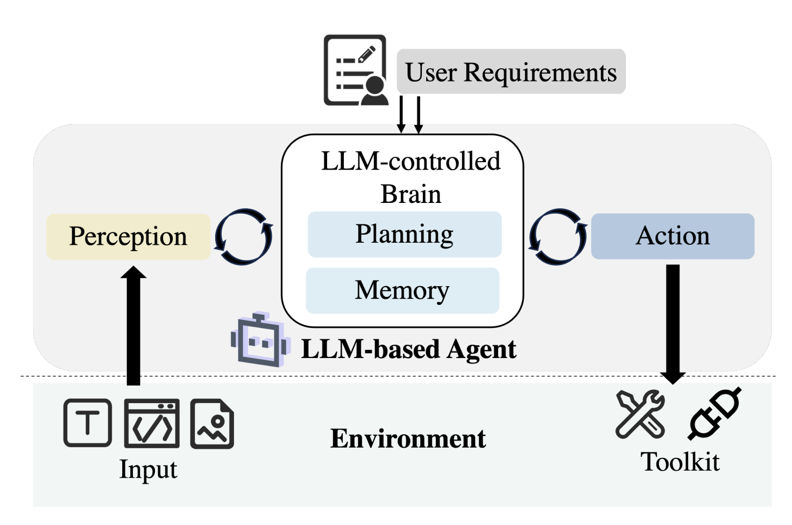
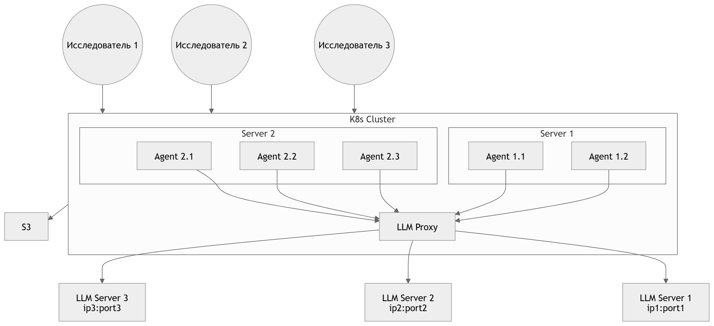
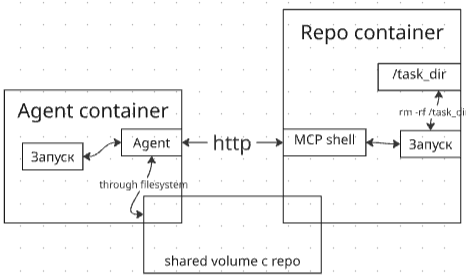
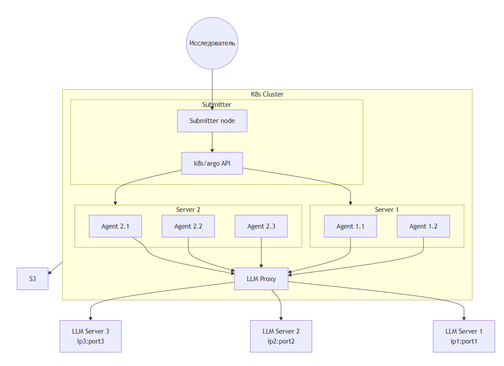
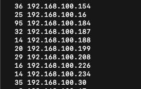

# Агентостроительный завод: путь от одного агента к тысячам

### **Как построить инфраструктуру для масштабного запуска кодовых агентов**
> JPoint 2026 | Егор Булычев


---


### Кому и зачем

> Многие из вас уже пользуется кодовыми агентами — GigaIDE, Codex, Cursor, Claude Code...
> Я расскажу, какой путь надо пройти, чтобы сделать сильную агентную кодовую модель
> А конкретно в этом докладе я расскажу про масштабирование запуска кодовых агентов

Этот доклад — про **кухню**: как запустить 1000 агентов параллельно и не сжечь кластер


---


### Кто я?
> Работаю в GigaCode в Сбере
> Работал в Huawei - занимался кодовыми моделями
> Работал в JetBrains
> Работал в стартапе, занимавшимся ML4Code еще до того, как это стало модным в 2017~2019 годах


<!-- https://qr-online.ru/ -->


---

### Что мы делаем?

#### Prod
* GigaIDE/plugin'ы для JB/VSCode
* GitVerse
* агентизация внутри сбербанка

#### RnD
* полный цикл обучения кодовых моделей (включая модель для автодополнения)
* от подготовки данных
* до пайплайнов обучения и обмеров


---

### О чём пойдёт речь


1. 1 агент
2. 10 агентов
3. 100 агентов
4. 1000 агентов

И о вагоне сложностей/интересностей, с которыми пришлось столкнуться по пути

---

### Чем программирование особенное?

В отличие от математики, текста, изображений:

- **Нужна изоляция**: каждая задача == свой контейнер с окружением
- **Риски**: запущенный код на компьютере с неограниченными правами == потенциальные проблемы
- **Автоматическая верификация**: автоматически проверяем тесты проходят или нет

За дополнительную сложность делаем возможным автоматическое масштабирование и верифицирование
# TODO автоматическое масштабирование  не следует ниоткуда

---

### Чем программирование особенное?


---

### Почему 1000 агентов?

- Мы живем в век ИИ - а это ~~век~~ 4 года масштабирования и скорости изменений
- Больше данных + больше модель + качественное обучение -> лучше результаты
- Цикл: **сбор данных → обучение → обмер модели** — должен быть быстрым
- 1000 параллельных агентов ≈ минимальная планка для быстрых итераций
- Цель: модель с близкими к SoTA-результатами на кодовых бенчмарках


---


### Зачем масштабировать?

> **СПОЙЛЕР:** лучшая модель у того, у кого быстрее итерации

<style scoped>
table {
    font-size: 15px;
    width: 100%;
    border-collapse: collapse;
}
th, td {
    border: 1px solid #ddd;
    padding: 8px;
    text-align: left;
}
th {
    background-color: #f2f2f2;
}
</style>

<table style="width: 100%; table-layout: fixed;">
  <thead>
    <tr>
      <th style="width: 25%;"></th>
      <th style="width: 25%;">БЫЛО (до платформы)</th>
      <th style="width: 25%;">СЕЙЧАС</th>
      <th style="width: 25%;">ЦЕЛЬ (ближайшая)</th>
    </tr>
  </thead>
  <tbody>
    <tr>
      <td><b>Вычисления (CPU)</b></td>
      <td>2 сервера, ручной Docker</td>
      <td>Kubernetes, 11+ нод, ресурсы на лету</td>
      <td>Эластичный кластер, авто-скейлинг</td>
    </tr>
    <tr>
      <td><b>Инференс (GPU)</b></td>
      <td>8 GPU, 1 машина</td>
      <td>96 GPU (12 × 8), единая точка доступа</td>
      <td>200+ GPU, объединение кластеров</td>
    </tr>
    <tr>
      <td><b>Параллельные агенты</b></td>
      <td>20 на 1 сервере</td>
      <td>200 стабильно</td>
      <td>1 000</td>
    </tr>
    <tr>
      <td><b>Замер бенчмарка (500 задач)</b></td>
      <td>~9–14 часов</td>
      <td>~2 часа</td>
      <td>&lt; 1 час</td>
    </tr>
    <tr>
      <td><b>Генерация 100к решений задач</b></td>
      <td>~100 дней</td>
      <td>~10 дней</td>
      <td>~дни</td>
    </tr>
  </tbody>
</table>

---

### Зачем масштабировать?

<style scoped>
table {
    font-size: 18px;
    width: 100%;
    border-collapse: collapse;
}
th, td {
    border: 1px solid #ddd;
    padding: 12px;
    text-align: left;
}
th {
    background-color: #f2f2f2;
}
</style>

<table style="width: 100%; table-layout: fixed;">
  <thead>
    <tr>
      <th style="width: 25%;">Стадия</th>
      <th style="width: 25%;">БЫЛО</th>
      <th style="width: 25%;">СЕЙЧАС</th>
      <th style="width: 25%;">ЦЕЛЬ (ближайшая)</th>
    </tr>
  </thead>
  <tbody>
    <tr>
      <td><b>Сбор данных</b></td>
      <td>100 дней</td>
      <td>10 дней</td>
      <td>2 дня</td>
    </tr>
    <tr>
      <td><b>Обучение</b></td>
      <td>7 дней</td>
      <td>7 дней</td>
      <td>7 дней</td>
    </tr>
    <tr>
      <td><b>Обмеры</b></td>
      <td>~1 день</td>
      <td>~2 часа</td>
      <td>~2 часа</td>
    </tr>
    <tr style="background-color: #f9f9f9; font-weight: bold;">
      <td>Суммарно</td>
      <td>~107 дней</td>
      <td>~17 дней</td>
      <td>~9 дней</td>
    </tr>
    <tr style="background-color: #eef; font-weight: bold;">
      <td>Ускорение</td>
      <td>1</td>
      <td>~6×</td>
      <td>~11×</td>
    </tr>
  </tbody>
</table>

<br>

**Зачем:** За то же самое время можно проверить в ~10 раз больше гипотез.

---


<style scoped>
h2 { text-align: left; }   /* заголовок оставляем слева */
p  { text-align: center; } /* картинка в markdown лежит в <p> */
</style>

## Один агент


---


### Анатомия запуска задачи - три фазы задачи

1. **Подготовка**: клонировать репозиторий, установить зависимости
2. **Решение**: запускается LLM + агентный фреймворк + изолированное окружение -> и агент вносит изменения
3. **Проверка**: запуск тестов, сбор результатов

> грубо один агент работает на SWE bench подобной задачей по фиксу проблемы 5~20 минут

#### TODO добавить слайд дальше - что для масштабирования мы сейчас склоняемся к парадигме codex - дал задачу и забыл. В конце презентации добавить 

---

### Что такое кодовый агент?

- LLM + набор инструментов (чтение файлов, редактирование, bash)
- Получает задачу: «исправь баг» / «добавь фичу»
- Работает в **окружении**

<!-- _backgroundPosition: right 100px center -->


---

# А как дела у больших дядь?

> Спасибо неожиданному облачному бэкапу кодовой базы Claude Code

---

### Рассмотрим его поближе
<!-- note: тут добавляем подробности-->


---
### Еще ближе

<!-- 1. Пользователь: отправляет запросы, утверждает разрешения, проверяет выходные данные. 
2. Интерфейсы: интерактивный интерфейс командной строки, автономный интерфейс командной строки (claude -p), агент SDK и IDE/рабочий стол/браузер. Все поверхности питают один и тот же контур. 
3. Цикл агента: итерационный цикл вызова модели, отправки инструментов и сбора результатов, реализованный как асинхронный генератор queryLoop() в query.ts.  
4. Система разрешений: оценка правила «сначала запрет» (permissions.ts), автоматический классификатор ML и перехват на основе перехватчиков (types/hooks.ts). 
5. Инструменты: до 54 встроенных инструментов (19 безусловных, 35 зависящих от флагов функций и типа пользователя), собранных с помощью assembleToolPool() (tools.ts), объединенных с инструментами, предоставляемыми MCP. Плагины вносят свой вклад косвенно через серверы MCP и реестр навыков/команд. 
6. Состояние и постоянство: в основном транскрипты сеансов JSONL только для добавления (sessionStorage.ts), глобальная история запросов (history.ts) и файлы боковой цепи субагента. 
7. Среда выполнения: выполнение оболочки с дополнительной изолированной программной средой (shouldUseSandbox.ts), операции с файловой системой, получение данных из Интернета, подключения к серверу MCP и удаленное выполнение.-->


---

### С чем придется столкнуться при разработке агентного фреймворка

Разработка агента — это не только промпты. Это 95+% качественного программирования:

*   **Reliability & Retries**: Модели «отваливаются» по таймаутам, 429 (Rate Limit) и 529 (Overloaded). Нужна умная очередь и экспоненциальный бэкбофф.
*   **Tooling**: Для кодовых моделей можно сделать много специализированных инструментов, которые будут помогать избегать ошибок типа поломанного кода (на основе tree-sitter,например) или автоматически проверять стиль.
*   **Context Management**: Бесконечный цикл «Tool Use -> Result» быстро забивает 200k контекста. Нужна многослойная компакция (snip, micro, auto-summarization).


---

### Оценка трудозатрат на топовый агентный фреймворк
> На основе кодовой базы Claude Code
* 2k файлов
* 513k строчек
* 10~15 человек (начинали с 2х)
* ~12-18 месяцев (какое-то время работали до публичного релиза)

> но базовый агентный фреймворк на коленке можно сделать за несколько дней

---

### TLDR - 1 агент
* нужна изоляция для задачи
* нужен агентный фреймворк
* нужен провайдер LLM (облачный или свой vllm)
* нужна автоверификация

---
# Десятки агентов


---
# Контекст
* 10-20 разработчиков-исследователей
* несколько серверов мощных с кучей CPU/RAM/disc
* docker'ы и тд - все доступно
* есть определенные ограничения безопасности - типа не выставлять наружу порты

---
# Задачи
* обмеры моделей
* эксперименты с агентными фреймворками
* сбор задач для агентов
* генерация синтетических данных для обучения

---
# Сбор задач для агентов

#### TODO у нас у всех какие-то задачи, но когда нужны десятки или сотни тысяч задач - все становится не так уж и просто
* перед тем как что-то решать агенту - надо подготовить задачу ему
* два пути
  * сбор реальных задач
  * сбор синтетических задач

---
# Сбор реальных задач
* SWE-MERA направление - бенчмарк под ключ
* парсить гитхаб - искать связанные issues <-> PR в репозиториях
* клонировать репозиторий
* подготовить образ
* верифицировать корректность задачи
  * до фикса какие-то тесты падают
  * после фикса проходят

TODO добавить воронку из ребенча

#### TODO слад бенчмарки - зачем нужно, что оценивают, как устроены - задача, окружение, алгоритм верификации 
#### TODO скриншоты гитхаба/gitverse с issues и тд. llm arena - ручная оценка задач, почему умирает (все модели стали хорошими, начинают смотреть на стиль, его тоже все подтянули, различить стало слоэно - поэтому все дрочат сложные задачи)

---
# Сбор синтетических задач
* парсить гитхаб, чтобы найти подходящие репозитории
* клонировать репозиторий
* подготовить образ
* верифицировать образ
  * все тесты должны проходить
* найти покртые тестами функции
* повредить их
  * проверить, что тесты не проходят

#### TODO скринщшот - был код до и после изменения - тело функции заменили на заглушку (посмотреть SWE-smith воронка)

---
# Обмеры моделей и генерация синтетических данных для обучения
* концептуально одинаковые задачи
* генерация и там, и там
* верификация и там, и там
* по сути map-reduce
  * map - для каждой задачи запустил агента
  * reduce - в конце посчитал pass rate или сохранил данные для обучения


---
# Что может пойти не так?


---
# Что может пойти не так?
Диски не бесконечные
* все пайплайны какие-то артефакты производят
* докеры занимают место
* ты не знаешь, нужны ли данные это
* МНОГО раз надо было коммуницировать, чтобы очистить место

---
# Что может пойти не так?
CPU/RAM не бесконечные
* коллеги запускают пайплайны
* они начинают падать, тк не хватает RAM
* они начинают тормозить, тк не хватает CPU

---
# Что может пойти не так?
Кто-то из коллег все таки может запустить агента без изоляции
* агент может запустить какой-то сервис для дебага на "нулях"
* безопасники автоматически детектируют нарушение
* прокидывают обучающий градиент

---
# Что может пойти не так?
Добавление железа требует усилий команды
* настройка
* выдача доступов КАЖДОМУ человеку на каждый новый сервак

---
# Что может пойти не так?
Кто какой порт занимает с vllm?
* много параллельных экспериментов
* у многих свои vllm подняты
* понять, кто занимает без обсуждения невозможно
* нет возможности МНОГО vllm сразу использовать для нагруженных пайплайнов

---
# Что может пойти не так?
Не смотря на наличие железа, нет возможности оркестрировать нормально
* надо настраивать окружение на нескольких машинх
* надо запускать скрипты на нескольких машинах
* как-то делить между ними задачи
* как-то собирать результаты
* НЕТ ВОЗМОЖНОСТИ МАСШТАБИРОВАТЬСЯ

---
# TODO DELETE

---
# TODO DELETE

---
# Что может пойти не так?
TLDR
* отсутствие масштабирования для пайплайнов
* инфраструктурный ад
или
# TODO перфеормулировать
* вместо использования железа для результатов
* агенты дерутся за CPU & RAM & DISC

---
# ....


повыше картинку

---
# Время переосмыслить процессы
#TODO мем вставить какой

---
# TODO DELETE

---
# Bare Metal vs Kubernetes

<style scoped>
table {
    font-size: 15px;
    width: 100%;
    border-collapse: collapse;
}
th, td {
    border: 1px solid #ddd;
    padding: 6px;
    text-align: left;
}
th {
    background-color: #f2f2f2;
}
</style>

<table style="width: 100%; table-layout: fixed;">
  <thead>
    <tr>
      <th style="width: 40%;">Критерий / Задача</th>
      <th style="width: 30%;">Bare Metal</th>
      <th style="width: 30%;">Kubernetes</th>
    </tr>
  </thead>
  <tbody>
    <tr>
      <td><b>Масштабирование</b><br><span style="font-size: 12px;">(запуск множества агентов)</span></td>
      <td style="background-color: #ffe6e6;">❌ Минус</td>
      <td style="background-color: #e6ffe6;">✅ Плюс<br><span style="font-size: 12px;">(можно запускать на многих серверах сразу)</span></td>
    </tr>
    <tr>
      <td><b>CPU/RAM</b></td>
      <td style="background-color: #ffe6e6;">❌ Минус</td>
      <td style="background-color: #e6ffe6;">✅ Плюс<br><span style="font-size: 12px;">(учитывает лимиты при запуске)</span></td>
    </tr>
    <tr>
      <td><b>Изоляция</b></td>
      <td style="background-color: #ffe6e6;">❌ Минус</td>
      <td style="background-color: #e6ffe6;">✅ Плюс<br><span style="font-size: 12px;">(работает ТОЛЬКО с контейнерами)</span></td>
    </tr>
    <tr>
      <td><b>Масштабный LLM inference</b></td>
      <td style="background-color: #ffe6e6;">❌ Минус</td>
      <td style="background-color: #ffe6e6;">❌ Минус</td>
    </tr>
    <tr>
      <td><b>Диски</b></td>
      <td style="background-color: #ffe6e6;">❌ Минус</td>
      <td style="background-color: #ffe6e6;">❌ Минус</td>
    </tr>
    <tr>
      <td><b>Многошаговые пайплайны</b><br><span style="font-size: 12px;">(DAG: установка → агент → тесты)</span></td>
      <td style="background-color: #e6ffe6;">✅ Плюс<br><span style="font-size: 12px;">(всё просто делается на Python)</span></td>
      <td style="background-color: #ffe6e6;">❌ Минус<br><span style="font-size: 12px;">(нет поддержки DAG из коробки)</span></td>
    </tr>

  </tbody>
</table>


---
# TODO DELETE ME

---
# Зачем нужен сервис LLM proxy?
Раньше
* 1 vllm проброшенная справлялась с 10-30 агентами на сервере

Хочется
* пробрасывать много vllm для десятков-сотен-тысяч агентов
* балансировать нагрузку между ними
* не надо каждому агенту указывать ip:port, будет единый для всех

---
# Зачем нужен сервис LLM proxy?
Раньше


---
# Зачем нужен сервис LLM proxy?
Теперь


---
# TODO delete me

---
# TODO delete me

---
# Как решить проблему с хранением артефактов
* диски - приняли решение сделать S3 главным хранилищем
  * "бесконечное" хранилище
  * разделяем ответственность с инфраструктурными командами
  * мониторинг и тд - на devops'ах - снимаем головную боль с себя
* диски на серверах
  * для текущих задач только


---

### Зачем нам нужен DAG?

```
┌── repo-export ────────────────────┐
│  instance-image → copy repo → S3  │
└───────────┬───────────────────────┘
            ▼
┌── agent-pod (ContainerSet) ───────┐
│  helper ←→ repo-sidecar ←→ agent  │
│  (S3)      (MCP bash)    (LLM)    │
└───────────┬───────────────────────┘
            ▼
┌── evaluate-pod ───────────────────┐
│  eval-helper → apply patch → test │
│  → metrics → S3                   │
└───────────────────────────────────┘
```

---

# Как решить с DAG
Отсутствие многошаговых пайплайнов решается через...

...посмотреть вокруг и взять готовое

---
# Что даёт Argo Workflows?
*(выжимка функционала "из коробки")*

* **Оркестрация пайплайнов (DAG / Steps)**
  * декларативное описание любых многошаговых задач
  * контроль параллелизма, циклы и условия (if/else)
  * SDK для написания пайплайнов на Python (Hera SDK), Go, Java
  * встроенный UI для визуализации графов выполнения пайплайнов
* **Надежность и отказоустойчивость**
  * ретраи, таймауты на уровне отдельных шагов и всего пайплайна
* **Observability (Наблюдаемость)**
  * встроенные метрики Prometheus "из коробки"

...искал медь, а нашел золото

---
# Итог: Инфраструктура мечты

<style scoped>
table {
    font-size: 14px;
    width: 100%;
    border-collapse: collapse;
}
th, td {
    border: 1px solid #ddd;
    padding: 6px;
    text-align: left;
}
th {
    background-color: #f2f2f2;
}
</style>

<table style="width: 100%; table-layout: fixed;">
  <thead>
    <tr>
      <th style="width: 25%;">Критерий / Задача</th>
      <th style="width: 22%;">Bare Metal</th>
      <th style="width: 23%;">Kubernetes</th>
      <th style="width: 30%;">K8s + Proxy + S3 + Argo</th>
    </tr>
  </thead>
  <tbody>
    <tr>
      <td><b>Масштабирование</b></td>
      <td style="background-color: #ffe6e6;">❌ Минус</td>
      <td style="background-color: #e6ffe6;">✅ Плюс</td>
      <td style="background-color: #e6ffe6;">✅ Плюс</td>
    </tr>
    <tr>
      <td><b>CPU/RAM</b></td>
      <td style="background-color: #ffe6e6;">❌ Минус</td>
      <td style="background-color: #e6ffe6;">✅ Плюс</td>
      <td style="background-color: #e6ffe6;">✅ Плюс</td>
    </tr>
    <tr>
      <td><b>Изоляция</b></td>
      <td style="background-color: #ffe6e6;">❌ Минус</td>
      <td style="background-color: #e6ffe6;">✅ Плюс</td>
      <td style="background-color: #e6ffe6;">✅ Плюс</td>
    </tr>
    <tr>
      <td><b>Масштабный LLM inference</b></td>
      <td style="background-color: #ffe6e6;">❌ Минус</td>
      <td style="background-color: #ffe6e6;">❌ Минус</td>
      <td style="background-color: #e6ffe6;">✅ Плюс</td>
    </tr>
    <tr>
      <td><b>Диски</b></td>
      <td style="background-color: #ffe6e6;">❌ Минус</td>
      <td style="background-color: #ffe6e6;">❌ Минус</td>
      <td style="background-color: #e6ffe6;">✅ Плюс<br><span style="font-size: 11px;">(S3 как безлимитное хранилище)</span></td>
    </tr>
    <tr>
      <td><b>Многошаговые пайплайны</b></td>
      <td style="background-color: #e6ffe6;">✅ Плюс</td>
      <td style="background-color: #ffe6e6;">❌ Минус</td>
      <td style="background-color: #e6ffe6;">✅ Плюс<br><span style="font-size: 11px;">(Argo Workflows)</span></td>
    </tr>

  </tbody>
</table>

---

# ...пора!


---
# Сотни агентов 


---
# TODO delete

---
# За пределами
* разворачивание кубера
* docker registry
* настройка доступов
* обучение работы с k8s/argo
* настройка соединения LLM <-> k8s
* и многое другое
~1 месяц рабочего времени

---
# Надо есть слона по кускам
* выбрали задачу для переноса
  * синтетические задачи - агенту надо починить поврежденную функцию, покрытую тестами
* из плюсов
  * один базовый образ - с python начали
* из особенностей
  * надо скачивать репозиторий и устанавливать зависимости
  * потом повреждать код

---
# Как выглядит посылка задачи в k8s?
* надо подготовить манифест
* манифест - это YAML файл, где прописано всЁ
  * образы
  * команды для запуска
  * переменные окружения
  * пути для монтирования
  * взаимосвязь контейнеров - какие вместе запускаются, порядок шагов
  * и еще примерно миллион технических деталей (retry, timeout'ы и тд)
* посылается в k8s с argo
  * argo workflow контроллер подхватывает задачу и исполняет ее

---

### Как выглядит 1 задача
* мы выбрали 2х контейнерное взаимодействие между агентом и репозиторием
* нюанс
  * изнутри контейнера нельзя пошарить директорию
  * приходится сделать дополнительный шаг, чтобы копировать репозиторий на S3
  * потом монтировать пустой volume в агента и репозиторий
  * туда подкладывать код репозитория

---
# Как выглядит работа агента в k8s?


---
# Как выглядит работа агента в k8s?
* запускается 2 контейнера
* для исполнения bash'евских команд
  * написан MCP сервер на golang, чтобы подкладывать бинарник в контейнер
  * агент через MCP шлет команды и получает назад результат исполнения
* за счет монтирования volume с репозиторием
  * агент имеет возможность модифицировать файлы через файловую систему
  * у нас у агента есть спец тулы с tree-sitter, 
    * которые позволяют детектировать поломанный код
    * это помогает избегать агенту проблем с синтаксисом

---
# С чем столкнулись при имплементации
У argo есть клевая фишка - batching
* но у API есть лимиты
* нельзя послать 10к задач сразу
* сделали посылку небольшими батчами

---
# С чем столкнулись при имплементации
Посылка небольшими батчами имеет свою особенность
* она ~~дико тормозная~~ медленная
* посылка тысяч манифестов, где каждый манифест несколько задач содержит, занимает часы
* нельзя выключать ноут, чувствительно к проблемам с сетью

---
# С чем столкнулись при имплементации
Сделали ноду-оркестратор



она позволила послать манифесты на нее и не ждать ничего

---
# С чем столкнулись при имплементации
* подсчитывать pass rate недобно через парсинг S3
* больно дебажить упавшие задачи

на удивление - ответ обоим проблемам один - МОНИТОРИНГ

---
# Мониторинг
k8s богат обвязками для мониторинга
* grafana
  * сервис для дашборд
* prometheus 
  * сервис для сбора метрик
* loki
  * поисковик по логам

---
# Мониторинг


сделали под себя кастомные дашборды - сразу видно pass rate, сколько бежало агентов и тд

---
# Мониторинг

распределение длительности работы агентов - оно подсвечивает, если что-то идет не так

---
# Мониторинг

время ответа LLM подсвечивает хорошо нагрузку на GPU сервера

---
# Сотни агентов
## Шаг 1
* на одном типе задач обкатали пайплайн
* обросли мониторингом
* поменяли стратегию посылки задач в кластер

---
# Сотни агентов
## Шаг 2
Новая задача - вышел SWE Rebench v2
* 32к задач с подготовленными образами
* 10+ языков программирования
* готовый пайплайн верификации решения
то что доктор прописал для генерации синтетики для обучения!

---
# SWE Rebench v2

неожиданный сюрприз - количество агентов начало дико скакать. В чем причина? 

---
# SWE Rebench v2

* упираемся в скачивание!

---
# SWE Rebench v2
Для решения этой проблемы
* сделали кэширование докер образов
* каждый образ из внешней сети лишь 1 раз скачивается
* внутренняя сеть гораздо большими лимитами обладает

---
# Сотни агентов
## Шаг 2
* добавили еще 1 пайплайн для генерации данных для обучения
* обросли кэшированием для докеров

---
# Сотни агентов
## Шаг 3
Появилась задача - обмерить кучу чекпоинтов наших моделей на
* swe bench verified
* swe bench multilingual
* swe bench pro

---
# Обмеры
* пайпайны начали падать из-за disc pressure
* дебаг показал, что несколько задач из бенчмарков при архивировании с материализацией symlink'ов превращаются в symlink бомбы

---
# symlink бомба
* репозиторий в зависимостях node_modules имеет ссылку сам на себя
* при разархивировании рекурсивно начинает копироваться
* диск умирает на сервере
* соседние задачи падают
* retry перезапускает задачу на другом сервере - соседний сервер тоже умирает


---
# Зачем копировать с материализацией symlink?
* часть репозиториев имеют ссылку на бинарники из контейнера
* после разархивирования эти ссылки ломаются

---
# symlink бомба
* по итогу исключили несколько задач из обмеров - и все заработало

---
# Обмеры
* когда замеряли много моделей параллельно - все работает хорошо
* когда начинаем замерять одну модель, запуская кучу агентов, кластеру плохеет снова

почему?

---
# Обмеры

все из-за стратегии распределения задач на кластере - 
* у нас стояло, чтобы похожие задачи запускались рядом на железе

---
# Обмеры
* поменяли, чтобы распределялись равномерно по кластеру
```
  42 192.168.100.184
  40 192.168.100.30
  29 192.168.100.208
  28 192.168.100.188
  25 192.168.100.234
  24 192.168.100.154
  20 192.168.100.199
  19 192.168.100.187
```

---
# Сотни агентов
## Шаг 3
* обросли несколькими пайплайнами обмеров
* не упомянул - но тут же добавили еще несколько агентных фреймворков
* научились обрабатывать еще несколько ошибок
* поменяли стратегию распределения задач по кластеру

---
# Сотни агентов
* имеем уже несколько пайплайнов генерации и обмеров
* обросли кучей сервисов дополнительных
* боремся за стабильность

---
# Тысячи агентов
* докидывать ресурсы в кластер
* докидывать новые пайплайны
  * билд агенты и тд
* мониторинг наше все - обрастать дашбордами
* понижать сложность использования для исследователей
* конфигурирование через git -> kuber
