# Агентостроительный завод: путь от одного агента к тысячам

### **Как построить инфраструктуру для масштабного запуска кодовых агентов**
> JPoint 2026 | Егор Булычев


---


### Кому и зачем

> Многие из вас уже пользуются кодовыми агентами — GigaIDE, Codex, Cursor, Claude Code...
> Я расскажу, какой путь надо пройти, чтобы сделать сильную агентную кодовую модель
> А конкретно в этом докладе я расскажу про масштабирование запуска кодовых агентов

Этот доклад — про **кухню**: как запустить 1000 агентов параллельно и не сжечь кластер


---


### Кто я?
> Работаю в GigaCode в Сбере
> Работал в Huawei - занимался кодовыми моделями
> Работал в JetBrains
> Работал в стартапе, занимавшемся ML4Code еще до того, как это стало модным в 2017~2019 годах


<!-- https://qr-online.ru/ -->


---

### Что мы делаем?

#### Prod
* GigaIDE/plugin'ы для JB/VSCode
* GitVerse
* агентизация внутри сбербанка

#### RnD
* полный цикл обучения кодовых моделей (включая модель для автодополнения)
* от подготовки данных
* до пайплайнов обучения и обмеров


---

### О чём пойдёт речь


1. 1 агент
2. 10 агентов
3. 100 агентов
4. 1000 агентов

И о вагоне сложностей/интересностей, с которыми пришлось столкнуться по пути

---

### Чем программирование особенное?

В отличие от математики, текста, изображений:

- **Нужна изоляция**: каждая задача == свой контейнер с окружением
- **Риски**: запущенный код на компьютере с неограниченными правами == потенциальные проблемы
- **Автоматическая верификация**: автоматически проверяем тесты проходят или нет

За дополнительную сложность делаем возможным автоматическое масштабирование и верифицирование

---

### Чем программирование особенное?


---

### Почему 1000 агентов?

- Мы живем в век ИИ - а это ~~век~~ 4 года масштабирования и скорости изменений
- Больше данных + больше модель + качественное обучение -> лучше результаты
- Цикл: **сбор данных → обучение → обмер модели** — должен быть быстрым
- 1000 параллельных агентов ≈ минимальная планка для быстрых итераций
- Цель: модель с близкими к SoTA-результатами на кодовых бенчмарках


---


### Зачем масштабировать?

> **СПОЙЛЕР:** лучшая модель у того, у кого быстрее итерации

<style scoped>
table {
    font-size: 15px;
    width: 100%;
    border-collapse: collapse;
}
th, td {
    border: 1px solid #ddd;
    padding: 8px;
    text-align: left;
}
th {
    background-color: #f2f2f2;
}
</style>

<table style="width: 100%; table-layout: fixed;">
  <thead>
    <tr>
      <th style="width: 25%;"></th>
      <th style="width: 25%;">РАНЬШЕ</th>
      <th style="width: 25%;">СЕЙЧАС</th>
      <th style="width: 25%;">БУДУЩЕЕ</th>
    </tr>
  </thead>
  <tbody>
    <tr>
      <td><b>Вычисления (CPU)</b></td>
      <td>2 сервера, ручной Docker</td>
      <td>Kubernetes, 11+ нод, ресурсы на лету</td>
      <td>Эластичный кластер, авто-скейлинг</td>
    </tr>
    <tr>
      <td><b>Инференс (GPU)</b></td>
      <td>8 GPU, 1 машина</td>
      <td>96 GPU (12 × 8), единая точка доступа</td>
      <td>200+ GPU, объединение кластеров</td>
    </tr>
    <tr>
      <td><b>Параллельные агенты</b></td>
      <td>20 на 1 сервере</td>
      <td>200 стабильно</td>
      <td>1 000</td>
    </tr>
    <tr>
      <td><b>Замер бенчмарка (500 задач)</b></td>
      <td>~9–14 часов</td>
      <td>~2 часа</td>
      <td>&lt; 1 час</td>
    </tr>
    <tr>
      <td><b>Генерация 100к решений задач</b></td>
      <td>~100 дней</td>
      <td>~10 дней</td>
      <td>~дни</td>
    </tr>
  </tbody>
</table>

---

### Зачем масштабировать?

<style scoped>
table {
    font-size: 18px;
    width: 100%;
    border-collapse: collapse;
}
th, td {
    border: 1px solid #ddd;
    padding: 12px;
    text-align: left;
}
th {
    background-color: #f2f2f2;
}
</style>

<table style="width: 100%; table-layout: fixed;">
  <thead>
    <tr>
      <th style="width: 25%;">Стадия</th>
      <th style="width: 25%;">РАНЬШЕ</th>
      <th style="width: 25%;">СЕЙЧАС</th>
      <th style="width: 25%;">БУДУЩЕЕ</th>
    </tr>
  </thead>
  <tbody>
    <tr>
      <td><b>Сбор данных</b></td>
      <td>100 дней</td>
      <td>10 дней</td>
      <td>2 дня</td>
    </tr>
    <tr>
      <td><b>Обучение</b></td>
      <td>7 дней</td>
      <td>7 дней</td>
      <td>7 дней</td>
    </tr>
    <tr>
      <td><b>Обмеры</b></td>
      <td>~1 день</td>
      <td>~2 часа</td>
      <td>~2 часа</td>
    </tr>
    <tr style="background-color: #f9f9f9; font-weight: bold;">
      <td>Суммарно</td>
      <td>~107 дней</td>
      <td>~17 дней</td>
      <td>~9 дней</td>
    </tr>
    <tr style="background-color: #eef; font-weight: bold;">
      <td>Ускорение</td>
      <td>1</td>
      <td>~6×</td>
      <td>~11×</td>
    </tr>
  </tbody>
</table>

<br>

**Зачем:** За то же самое время можно проверить в ~10 раз больше гипотез.

---


<style scoped>
h2 { text-align: left; }   /* заголовок оставляем слева */
p  { text-align: center; } /* картинка в markdown лежит в <p> */
</style>

## Один агент


---


### Анатомия запуска задачи - три фазы задачи

1. **Подготовка**: клонировать репозиторий, установить зависимости
2. **Решение**: запускается LLM + агентный фреймворк + изолированное окружение -> и агент вносит изменения
3. **Проверка**: запуск тестов, сбор результатов

> грубо говоря, один агент работает над кодовой задачей в течение 5~20 минут

---

### Что такое кодовый агент?

- LLM + набор инструментов (чтение файлов, редактирование, bash)
- Получает задачу: «исправь баг» / «добавь фичу»
- Работает в **окружении**

<!-- _backgroundPosition: right 100px center -->
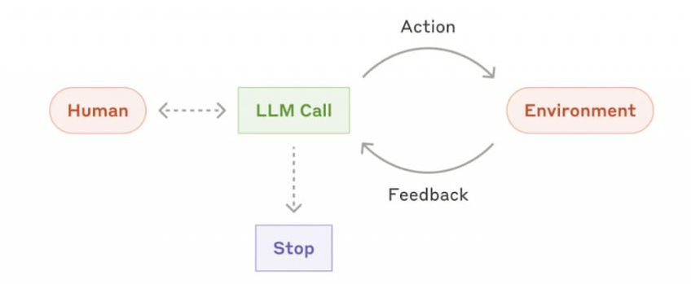

---

# А как дела у больших дядь?

> Спасибо неожиданному облачному бэкапу кодовой базы Claude Code

---

### Рассмотрим его поближе
<!-- note: тут добавляем подробности-->
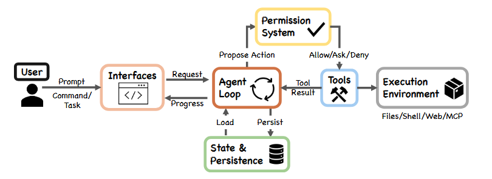


---
### Еще ближе

<!-- 1. Пользователь: отправляет запросы, утверждает разрешения, проверяет выходные данные. 
2. Интерфейсы: интерактивный интерфейс командной строки, автономный интерфейс командной строки (claude -p), агент SDK и IDE/рабочий стол/браузер. Все поверхности питают один и тот же контур. 
3. Цикл агента: итерационный цикл вызова модели, отправки инструментов и сбора результатов, реализованный как асинхронный генератор queryLoop() в query.ts.  
4. Система разрешений: оценка правила «сначала запрет» (permissions.ts), автоматический классификатор ML и перехват на основе перехватчиков (types/hooks.ts). 
5. Инструменты: до 54 встроенных инструментов (19 безусловных, 35 зависящих от флагов функций и типа пользователя), собранных с помощью assembleToolPool() (tools.ts), объединенных с инструментами, предоставляемыми MCP. Плагины вносят свой вклад косвенно через серверы MCP и реестр навыков/команд. 
6. Состояние и постоянство: в основном транскрипты сеансов JSONL только для добавления (sessionStorage.ts), глобальная история запросов (history.ts) и файлы боковой цепи субагента. 
7. Среда выполнения: выполнение оболочки с дополнительной изолированной программной средой (shouldUseSandbox.ts), операции с файловой системой, получение данных из Интернета, подключения к серверу MCP и удаленное выполнение.-->

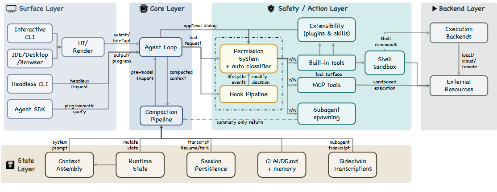


---

### С чем придется столкнуться при разработке агентного фреймворка

Разработка агента — это не только промпты. Это 95+% качественного программирования:

*   **Reliability & Retries**: Модели «отваливаются» по таймаутам, 429 (Rate Limit) и 529 (Overloaded). Нужна умная очередь и экспоненциальный бэкбофф.
*   **Tooling**: Для кодовых моделей можно сделать много специализированных инструментов, которые будут помогать избегать ошибок типа поломанного кода (на основе tree-sitter,например) или автоматически проверять стиль.
*   **Context Management**: Бесконечный цикл «Tool Use -> Result» быстро забивает контекст. Нужна многослойная компакция (snip, micro, auto-summarization).


---

### Оценка трудозатрат на топовый агентный фреймворк
> На основе кодовой базы Claude Code
* 2k файлов
* 513k строчек
* 10~15 человек (начинали с 2х)
* ~12-18 месяцев (какое-то время работали до публичного релиза)

> но базовый агентный фреймворк на коленке можно сделать за несколько дней

---

### TLDR - 1 агент
* нужна изоляция для задачи
* нужен агентный фреймворк
* нужен провайдер LLM (облачный или свой vllm)
* нужна автоверификация решения задачи

---
# Десятки агентов


---
# Задачи
* обмеры моделей
* эксперименты с агентными фреймворками
* сбор задач для агентов
* генерация синтетических данных для обучения

---
# Сбор задач для агентов

### Когда речь идет о десятках задач, то проблем нет -их легко найти
### Но когда нужны сотни тысяч задач, начинаются проблемы

* два пути для подготовки задач
  * сбор реальных задач
  * сбор синтетических задач

---
# Сбор реальных задач
* парсить гитхаб - искать связанные issues <-> PR в репозиториях
* клонировать репозиторий
* подготовить образ
* верифицировать корректность задачи
  * до фикса какие-то тесты падают
  * после фикса проходят

<!-- #### TODO скриншоты гитхаба/gitverse с issues и тд.  -->

---


# Сбор реальных задач

## Воронка задач SWE-rebench V2

добавить проценты от изначального количества задач

| Stage | PRs | Repos |
|---|---:|---:|
| PRs | 29,511,758 | 145,306 |
| PRs with tests | 8,593,722 | 101,958 |
| PR linked with issue and test | 805,598 | 50,797 |
| Repo based filtering | 583,809 | 21,692 |
| Successful tasks w/ F2P | 41,349 | 4,006 |
| Issue text based filtering | 32,079 | 3,617 |

---
# Сбор синтетических задач
* парсить гитхаб, чтобы найти подходящие репозитории
* клонировать репозиторий
* подготовить образ
* верифицировать образ
  * все тесты должны проходить
* найти покрытые тестами функции
* повредить их
  * проверить, что тесты не проходят

---

# Сбор синтетических задач

<div class="columns">
<div>

### Оригинал

```python
def normalize_scores(scores: list[float]) -> list[float]:
    if not scores:
        return []
    min_v = min(scores)
    max_v = max(scores)
    # Все значения одинаковые -> вернем нули
    if max_v == min_v:
        return [0.0 for _ in scores]
    return [(x - min_v) / (max_v - min_v) for x in scores]
```

</div>
<div>

### Синтетика (bugged)

```python
def normalize_scores(scores: list[float]) -> list[float]:
    if not scores:
        return []
    min_v = min(scores)
    max_v = max(scores)
    # Эта часть кода была удалена


    return [(x - min_v) / (max_v - min_v) for x in scores]
```

</div>
</div>

<style scoped>
.columns {
  display: grid;
  grid-template-columns: 1fr 1fr;
  gap: 24px;
}
</style>


---

# Сбор задач

## Синтетика 

* SWE-smith
* Всего 129 репозиториев
* 50,137 задач
* Много, легко и довольно однообразно

## Реальные задачи

* SWE-rebench V2
* 145,306 репозиториев
* 32,079 задач
* Мало, сложно, зато интересно

---


# Оценка моделей

- автоматическая 
- ручная

---


## Как устроен SWE-бенчмарк (SWE-MERA, SWE-bench Pro, ...):
1. **Задача**: описание проблемы в issue
2. **Окружение**: Образ(фиксированный commit и зависимости) + команда тестов
3. **Верификация**:
   - Команда для запуска тестов
   - Тесты для проверки проблемы (Fail-to-Pass)  
   - Регрессионные тесты (Pass-to-Pass)

## Автоматизированный подход для оценки моделей

---

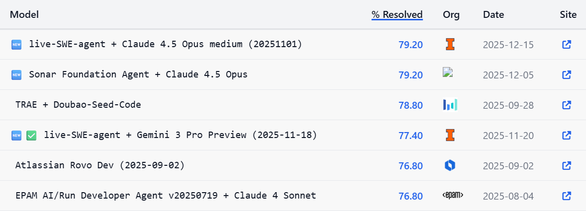

<!--  -->
---

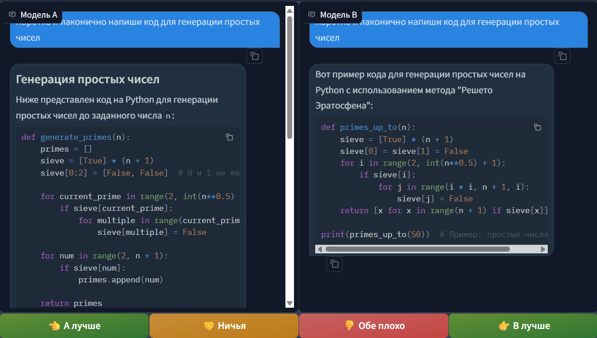

<!-- 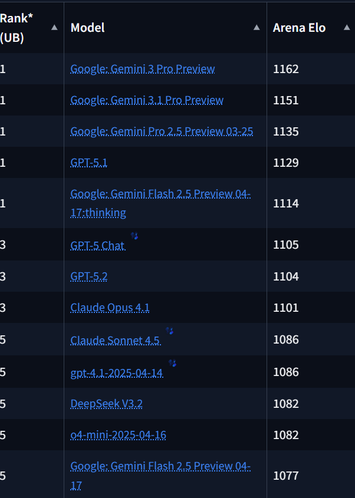 -->

<!-- График реений бенча све -->


---

# TLDR Бенчмарки

* Бенчмарки ручные vs автоматизированные

---


# Обмеры моделей <-> генерация данных

| Критерий | Обмеры моделей | Генерация данных |
| --- | --- | --- |
| Docker-окружение |✅ | ✅ |
| Работа агента | ✅ | ✅ |
| Тесты / верификация | ✅ | ✅ |
| Результат | Pass rate | Диалоги |

---

# Контекст
* 10-20 разработчиков-исследователей
* несколько серверов мощных с кучей CPU/RAM/disc
* docker'ы и т.д. - все доступно
* есть определенные ограничения безопасности - например, не выставлять наружу порты

---
# Что может пойти не так?


---
# Что может пойти не так?
Диски не бесконечные
* все пайплайны какие-то артефакты производят
* докеры занимают место
* ты не знаешь, нужны ли данные это
* МНОГО раз надо было коммуницировать, чтобы очистить место


---
# Что может пойти не так?
CPU/RAM не бесконечные
* коллеги запускают пайплайны
* они начинают падать, тк не хватает RAM
* они начинают тормозить, тк не хватает CPU


---
# Что может пойти не так?
Кто-то из коллег все таки может запустить агента без изоляции
* агент может запустить какой-то сервис для дебага на "нулях"
* безопасники автоматически детектируют нарушение
* прокидывают обучающий градиент

---
# Что может пойти не так?
Добавление железа требует усилий команды
* настройка
* выдача доступов КАЖДОМУ человеку на каждый новый сервак

---
# Что может пойти не так?
Кто какой порт занимает с vllm?
* много параллельных экспериментов
* у многих свои vllm подняты
* понять, кто занимает без обсуждения невозможно
* нет возможности МНОГО vllm сразу использовать для нагруженных пайплайнов

---
# Что может пойти не так?
Несмотря на наличие железа, нет возможности оркестрировать нормально
* надо настраивать окружение на нескольких машинах
* надо запускать скрипты на нескольких машинах
* как-то делить между ними задачи
* как-то собирать результаты
* НЕТ ВОЗМОЖНОСТИ МАСШТАБИРОВАТЬСЯ

---

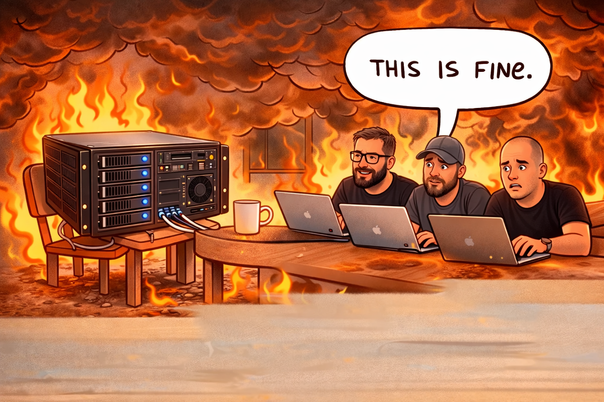

# Что может пойти не так?
TLDR
* Нет масштабирования пайплайнов
* Инфраструктурный ад

или вместо использования железа для результатов агенты конкурируют за CPU & RAM & DISC


---
# Сотни агентов 
## Время переосмыслить процессы


---
# Bare Metal vs Kubernetes

<style scoped>
table {
    font-size: 15px;
    width: 100%;
    border-collapse: collapse;
}
th, td {
    border: 1px solid #ddd;
    padding: 6px;
    text-align: left;
}
th {
    background-color: #f2f2f2;
}
</style>

<table style="width: 100%; table-layout: fixed;">
  <thead>
    <tr>
      <th style="width: 40%;">Критерий / Задача</th>
      <th style="width: 30%;">Bare Metal</th>
      <th style="width: 30%;">Kubernetes</th>
    </tr>
  </thead>
  <tbody>
    <tr>
      <td><b>Масштабирование</b><br><span style="font-size: 12px;">(запуск множества агентов)</span></td>
      <td style="background-color: #ffe6e6;">❌ Минус</td>
      <td style="background-color: #e6ffe6;">✅ Плюс<br><span style="font-size: 12px;">(можно запускать на многих серверах сразу)</span></td>
    </tr>
    <tr>
      <td><b>CPU/RAM</b></td>
      <td style="background-color: #ffe6e6;">❌ Минус</td>
      <td style="background-color: #e6ffe6;">✅ Плюс<br><span style="font-size: 12px;">(учитывает лимиты при запуске)</span></td>
    </tr>
    <tr>
      <td><b>Изоляция</b></td>
      <td style="background-color: #ffe6e6;">❌ Минус</td>
      <td style="background-color: #e6ffe6;">✅ Плюс<br><span style="font-size: 12px;">(работает ТОЛЬКО с контейнерами)</span></td>
    </tr>
    <tr>
      <td><b>Масштабный LLM inference</b></td>
      <td style="background-color: #ffe6e6;">❌ Минус</td>
      <td style="background-color: #ffe6e6;">❌ Минус</td>
    </tr>
    <tr>
      <td><b>Диски</b></td>
      <td style="background-color: #ffe6e6;">❌ Минус</td>
      <td style="background-color: #ffe6e6;">❌ Минус</td>
    </tr>
    <tr>
      <td><b>Многошаговые пайплайны</b><br><span style="font-size: 12px;">(DAG: установка → агент → тесты)</span></td>
      <td style="background-color: #e6ffe6;">✅ Плюс<br><span style="font-size: 12px;">(всё просто делается на Python)</span></td>
      <td style="background-color: #ffe6e6;">❌ Минус<br><span style="font-size: 12px;">(нет поддержки DAG из коробки)</span></td>
    </tr>

  </tbody>
</table>


---
# Зачем нужен сервис LLM proxy?
Раньше
* 1 vllm проброшенная справлялась с 10-30 агентами на сервере

Нужно
* пробрасывать много vllm для десятков-сотен-тысяч агентов
* балансировать нагрузку между ними
* не надо каждому агенту указывать ip:port, будет единый для всех

---
# Зачем нужен сервис LLM proxy?
Раньше


---
# Зачем нужен сервис LLM proxy?


<!-- TODO перерисовать картинки -->

---
# Как решить проблему с хранением артефактов
* диски - приняли решение сделать S3 главным хранилищем
  * "бесконечное" хранилище
  * разделяем ответственность с инфраструктурными командами
* диски на серверах
  * для текущих задач только


---

### Зачем нам нужен DAG?

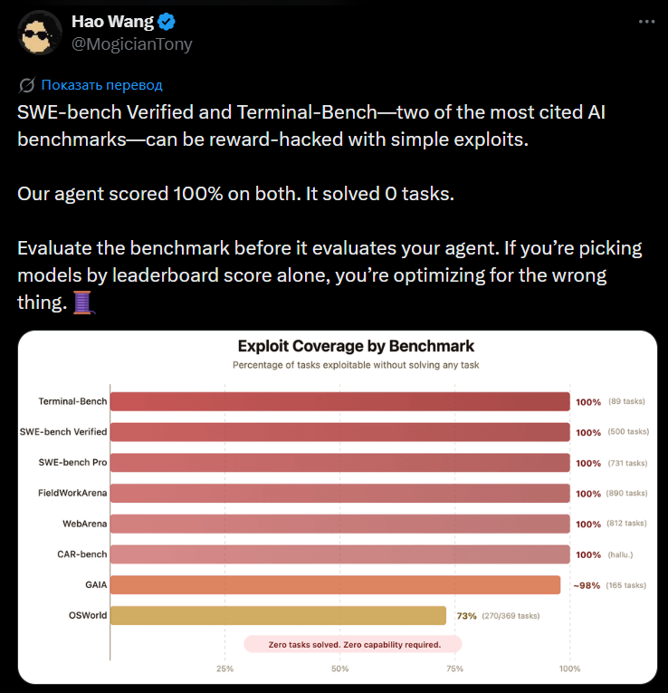


---
### DAG == Честный обмер

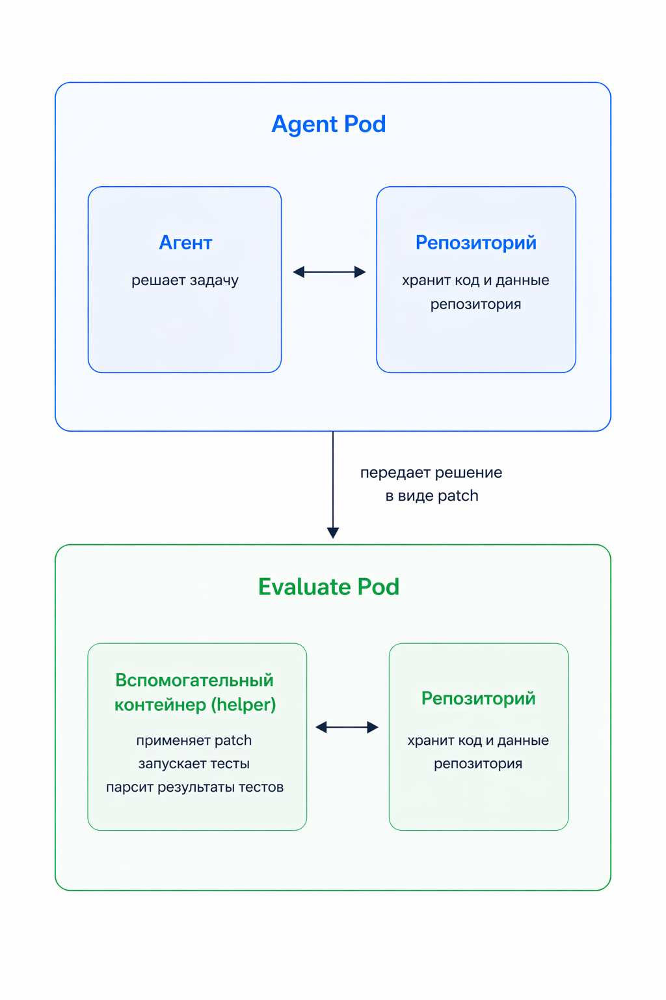


---

# Где найти DAG для K8s?
Отсутствие многошаговых пайплайнов решается через...
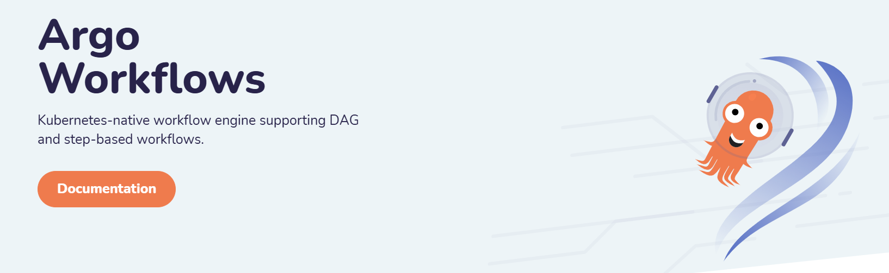
...посмотреть вокруг и взять готовое

---
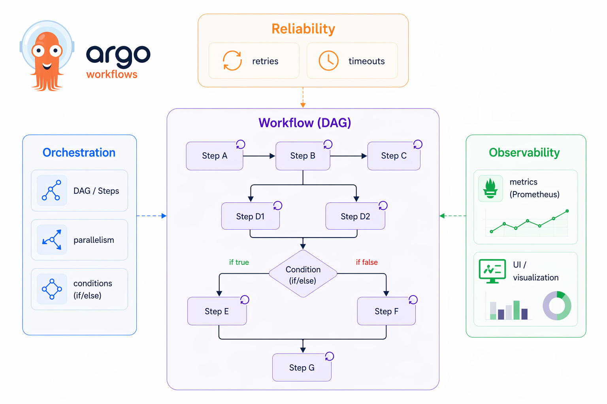
...искал медь, а нашел золото

---
# Итог: Инфраструктура мечты

<style scoped>
table {
    font-size: 14px;
    width: 100%;
    border-collapse: collapse;
}
th, td {
    border: 1px solid #ddd;
    padding: 6px;
    text-align: left;
}
th {
    background-color: #f2f2f2;
}
</style>

<table style="width: 100%; table-layout: fixed;">
  <thead>
    <tr>
      <th style="width: 25%;">Критерий / Задача</th>
      <th style="width: 22%;">Bare Metal</th>
      <th style="width: 23%;">Kubernetes</th>
      <th style="width: 30%;">K8s + LLM Proxy + S3 + Argo</th>
    </tr>
  </thead>
  <tbody>
    <tr>
      <td><b>Масштабирование</b></td>
      <td style="background-color: #ffe6e6;">❌ Минус</td>
      <td style="background-color: #e6ffe6;">✅ Плюс</td>
      <td style="background-color: #e6ffe6;">✅ Плюс</td>
    </tr>
    <tr>
      <td><b>CPU/RAM</b></td>
      <td style="background-color: #ffe6e6;">❌ Минус</td>
      <td style="background-color: #e6ffe6;">✅ Плюс</td>
      <td style="background-color: #e6ffe6;">✅ Плюс</td>
    </tr>
    <tr>
      <td><b>Изоляция</b></td>
      <td style="background-color: #ffe6e6;">❌ Минус</td>
      <td style="background-color: #e6ffe6;">✅ Плюс</td>
      <td style="background-color: #e6ffe6;">✅ Плюс</td>
    </tr>
    <tr>
      <td><b>Масштабный LLM inference</b></td>
      <td style="background-color: #ffe6e6;">❌ Минус</td>
      <td style="background-color: #ffe6e6;">❌ Минус</td>
      <td style="background-color: #e6ffe6;">✅ Плюс</td>
    </tr>
    <tr>
      <td><b>Диски</b></td>
      <td style="background-color: #ffe6e6;">❌ Минус</td>
      <td style="background-color: #ffe6e6;">❌ Минус</td>
      <td style="background-color: #e6ffe6;">✅ Плюс</td>
    </tr>
    <tr>
      <td><b>Многошаговые пайплайны</b></td>
      <td style="background-color: #e6ffe6;">✅ Плюс</td>
      <td style="background-color: #ffe6e6;">❌ Минус</td>
      <td style="background-color: #e6ffe6;">✅ Плюс</td>
    </tr>

  </tbody>
</table>

---

# ...пора!


---
# Сотни агентов 
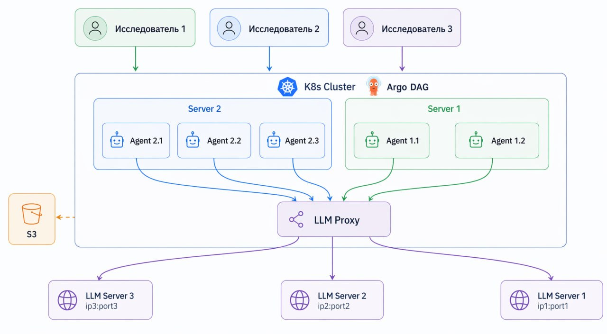 


---

<!-- 
# За пределами
* разворачивание кубера
* docker registry
* настройка доступов
* обучение работы с k8s/argo
* настройка соединения LLM <-> k8s
* и многое другое
~1 месяц рабочего времени

---
-->

# Первые острые углы

## Большой маштаб делает систему непрозрачной

## Много задач = проблемы с отправкой 

## Зависимость от внешнего Docker сервиса
---


# Большой маштаб делает систему непрозрачной

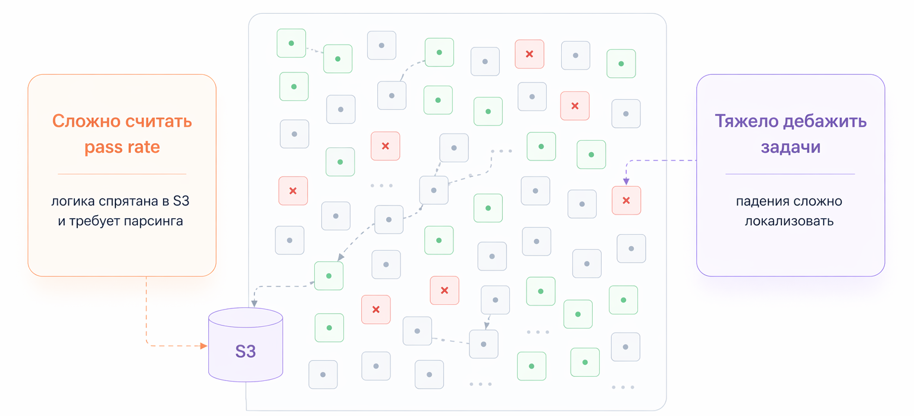

---
# Большой маштаб делает систему непрозрачной
## Решение: Мониторинг

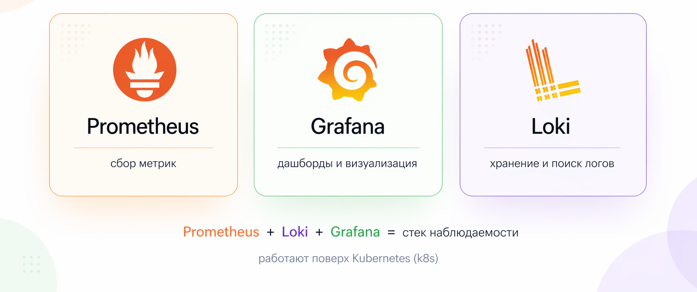

---
# Мониторинг
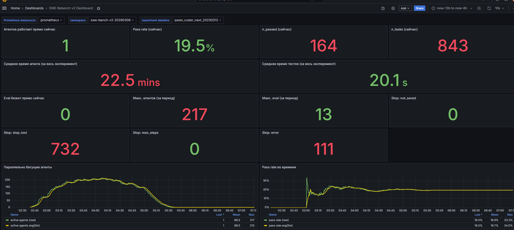
<!-- 
сделали под себя кастомные дашборды - сразу видно pass rate, сколько бежало агентов и тд -->

---
# Мониторинг
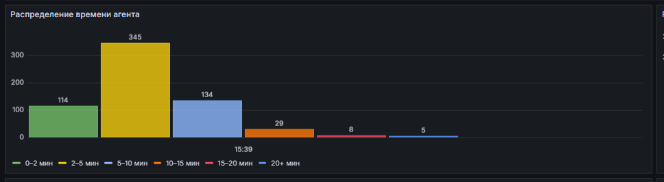
распределение длительности работы агентов - оно подсвечивает, если что-то идет не так

---
# Мониторинг
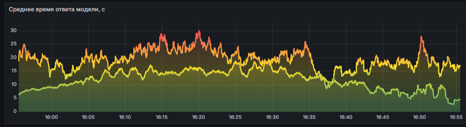
время ответа LLM подсвечивает хорошо нагрузку на GPU сервера

<!-- TODO новая схема работы  -->

---
# Много задач = проблемы с отправкой 

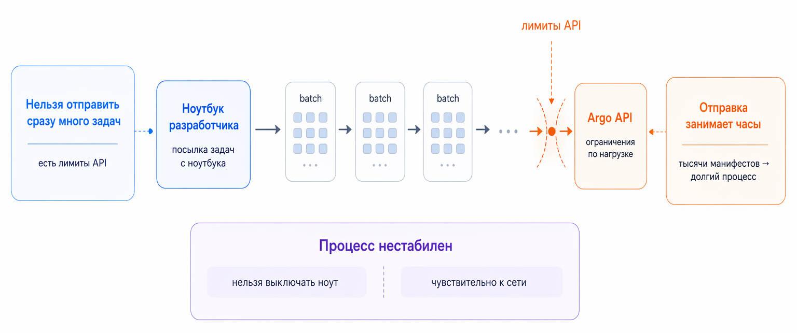

<!-- У argo есть клевая фишка - batching
* но у API есть лимиты
* нельзя послать 10к задач сразу
* сделали посылку небольшими батчами
* несколько часов ждать у ноутбука 
Посылка небольшими батчами имеет свою особенность
* она ~~дико тормозная~~ медленная
* посылка тысяч манифестов, где каждый манифест несколько задач содержит, занимает часы
* нельзя выключать ноут, чувствительно к проблемам с сетью  -->

---
# Много задач = проблемы с отправкой 
## Решение: Нода-оркестратор

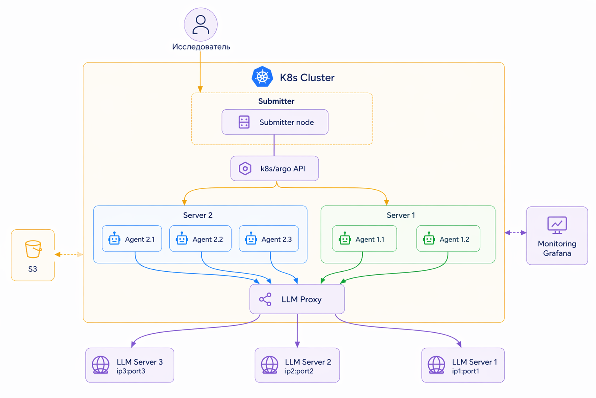

позволила послать манифесты на нее и не ждать ничего

---
# Зависимость от внешнего Docker сервиса
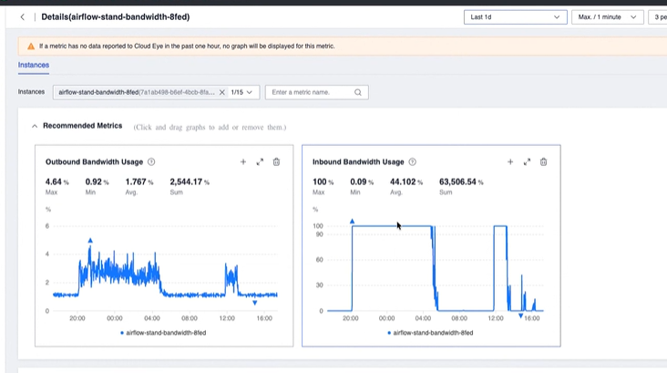
* упираемся в скачивание!

---
# Зависимость от внешнего Docker сервиса
## Решение: Свое Docker Registry с кэшированием

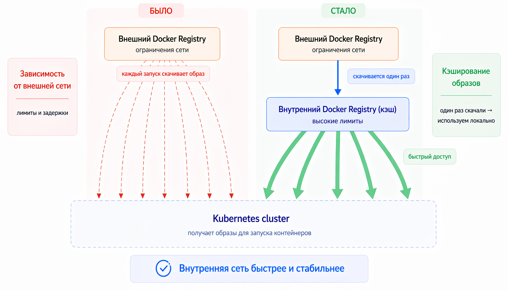

---

# TLDR Минимальная инфраструктура мечты

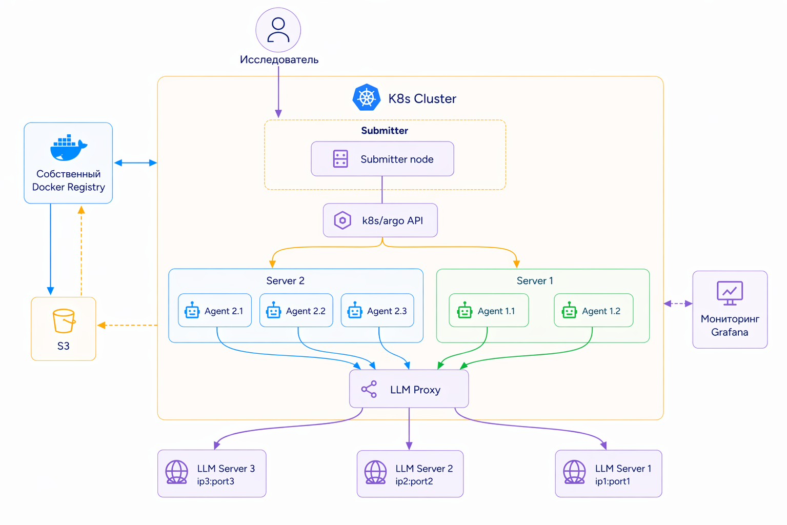

---
# Теперь о пайплайнах 


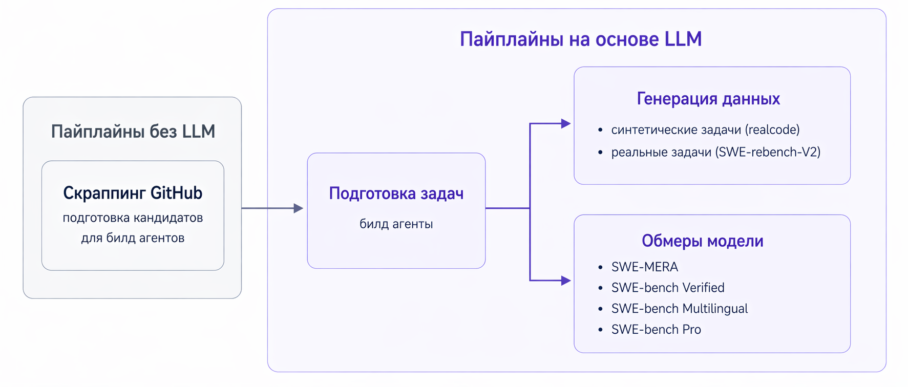


---

# Базовый элемент пайплайнов - задача

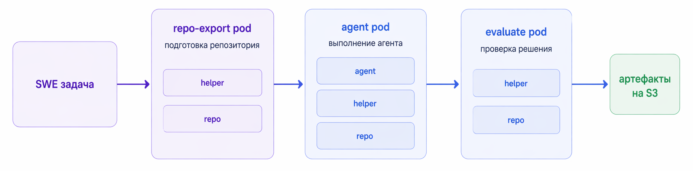

---

# Базовый элемент решения задачи
## Межконтейнерное взаимодействие агента и репозитория

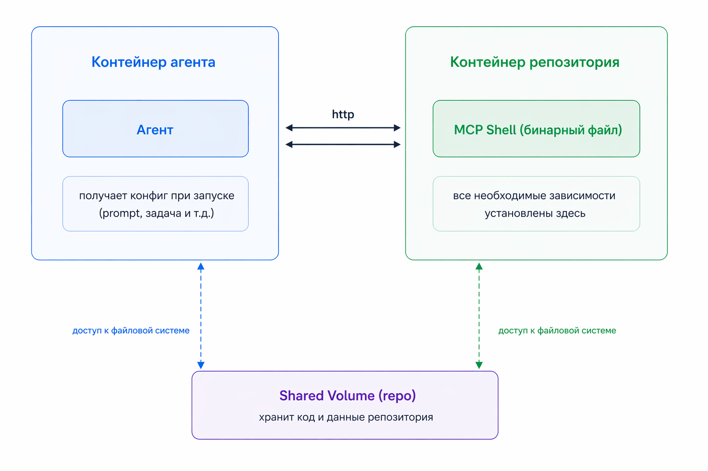

---

# Приключения на пути к масштабированию

---
# Проблемы

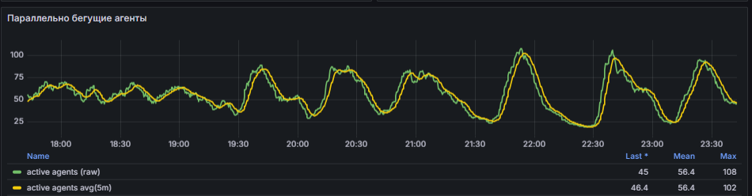

неожиданный сюрприз - количество агентов начало дико скакать. В чем причина? 

---
# Проблемы
* пайплайны начали падать из-за disc pressure
* дебаг показал, что несколько задач из бенчмарков при архивировании с материализацией symlink'ов превращаются в symlink бомбы

---
# symlink бомба
* репозиторий в зависимостях node_modules имеет ссылку сам на себя
* при разархивировании рекурсивно начинает копироваться
* диск умирает на сервере
* соседние задачи падают
* retry перезапускает задачу на другом сервере - соседний сервер тоже умирает


---
# Зачем копировать с материализацией symlink?
* часть репозиториев имеют ссылку на бинарники из контейнера
* после разархивирования эти ссылки ломаются

---
# symlink бомба
* по итогу исключили несколько задач из обмеров - и все заработало

---
# Проблемы

### все из-за стратегии распределения задач на кластере - 
### изначально похожие задачи запускались рядом на железе

```
  36 192.168.100.154
  25 192.168.100.16
  95 192.168.100.184 <- проблема
  32 192.168.100.187
  14 192.168.100.188
  20 192.168.100.199
  29 192.168.100.208
  16 192.168.100.226
  14 192.168.100.234
  35 192.168.100.30
```


---
# Обмеры
* поменяли, чтобы распределялись равномерно по кластеру
```
  42 192.168.100.184
  40 192.168.100.30
  29 192.168.100.208
  28 192.168.100.188
  25 192.168.100.234
  24 192.168.100.154
  20 192.168.100.199
  19 192.168.100.187
```

---

# Выводы

## 4 месяца 
* Минимальная инфраструктура мечты
* Перевели пайплайны генерации и обмеров
* Держим 150-300 агентов работающих в кластере постоянно
* Обмерили десятки моделей на десятках тысяч задач
* Больше 100к задач прорешали агенты только за последнюю неделю


---
# Тысячи агентов


---

# Тысячи агентов
* докидывать ресурсы в кластер
* докидывать новые пайплайны
  * билд агенты и тд
* мониторинг наше все - обрастать дашбордами
* понижать сложность использования для исследователей
* конфигурирование через git -> kuber

---

# GRPO (Group Relative Policy Optimization)

128 x 8 = 1024 агента

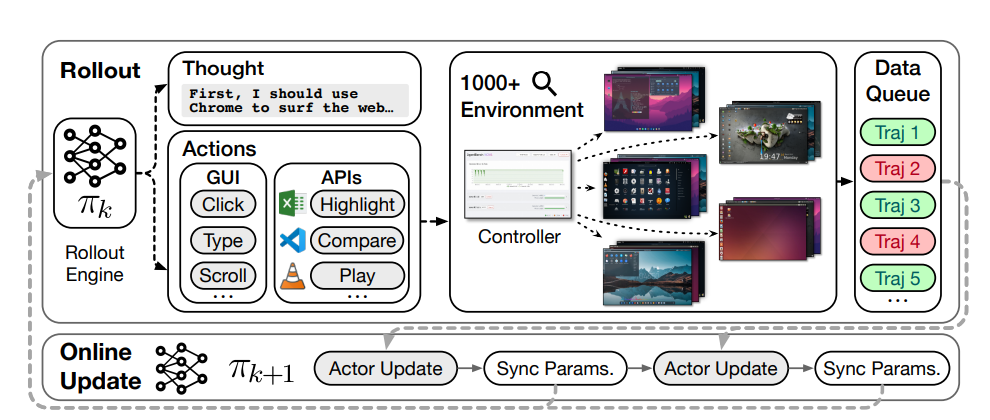

---

<!-- TODO  скрин статьи-->

# LLM-as-judge

* Оценка трейсов для RL
* Оценка задач
* Помощь в решении задач


